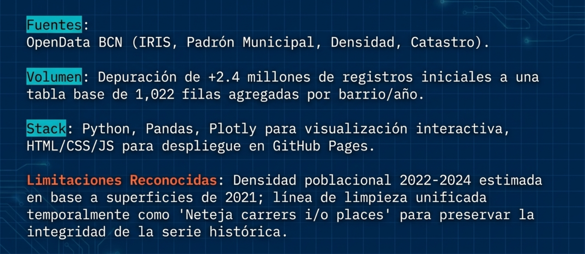
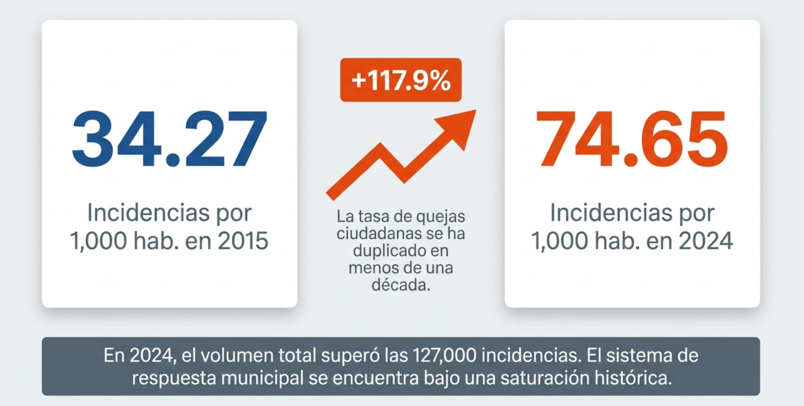

```{python}
#| label: setup
from pathlib import Path
import sys
import json
import unicodedata
import re
import warnings

import numpy as np
import pandas as pd
import plotly.express as px
import plotly.graph_objects as go
from plotly.subplots import make_subplots
import matplotlib.pyplot as plt
import seaborn as sns

warnings.filterwarnings("ignore", category=FutureWarning)

ruta_actual = Path.cwd().resolve()
ruta_proyecto = ruta_actual
for posible_ruta in [ruta_actual, *ruta_actual.parents]:
    if (posible_ruta / "src").exists() and (posible_ruta / "datos").exists():
        ruta_proyecto = posible_ruta
        break

if str(ruta_proyecto) not in sys.path:
    sys.path.append(str(ruta_proyecto))

from src.rutas_proyecto import RUTA_DATOS_PROCESSED

RUTA_ANALISIS = RUTA_DATOS_PROCESSED / "analisis"
RUTA_IMG = ruta_proyecto / "entrega_final_2_notebooks" / "quarto_assets" / "notebook_images"

tabla_base = pd.read_csv(RUTA_DATOS_PROCESSED / "tabla_base_barrio_anio.csv")
tabla_base["any"] = tabla_base["any"].astype(int)
tabla_base["codi_barri"] = tabla_base["codi_barri"].astype(str)

serie_ciudad = pd.read_csv(RUTA_ANALISIS / "serie_ciudad_poblacion_incidencias_2015_2024.csv")
df_2024 = pd.read_csv(RUTA_ANALISIS / "analisis_poblacion_densidad_2024.csv")
crecimiento_barrios = pd.read_csv(RUTA_ANALISIS / "crecimiento_barrios_2015_2024.csv")
incidencias_totales_2024 = pd.read_csv(RUTA_ANALISIS / "incidencias_totales_barrio_2024.csv")
incidencias_totales_2025 = pd.read_csv(RUTA_ANALISIS / "incidencias_totales_barrio_2025.csv")
resumen_areas_2024 = pd.read_csv(RUTA_ANALISIS / "resumen_areas_incidencias_2024.csv")
resumen_areas_2025 = pd.read_csv(RUTA_ANALISIS / "resumen_areas_incidencias_2025.csv")
resumen_detalles_2024 = pd.read_csv(RUTA_ANALISIS / "resumen_detalles_incidencias_2024.csv")
resumen_detalles_2025 = pd.read_csv(RUTA_ANALISIS / "resumen_detalles_incidencias_2025.csv")
area_dominante_barrio_2024 = pd.read_csv(RUTA_ANALISIS / "area_dominante_barrio_2024.csv")
equidad_barrio_2022 = pd.read_csv(RUTA_ANALISIS / "equidad_barrio_2022.csv")
serie_regresion = pd.read_csv(RUTA_ANALISIS / "serie_regresion_incidencias_2015_2025.csv")
proyeccion_incidencias = pd.read_csv(RUTA_ANALISIS / "proyeccion_incidencias_2025_2026.csv")
tendencia_poblacion_incidencias_2024 = pd.read_csv(RUTA_ANALISIS / "tendencia_poblacion_incidencias_2024.csv")

for df_tmp in [
    df_2024,
    crecimiento_barrios,
    incidencias_totales_2024,
    incidencias_totales_2025,
    area_dominante_barrio_2024,
    equidad_barrio_2022,
]:
    if "codi_barri" in df_tmp.columns:
        df_tmp["codi_barri"] = df_tmp["codi_barri"].astype(str)

def normalizar_texto(texto):
    texto = str(texto).lower().strip()
    texto = unicodedata.normalize("NFKD", texto)
    texto = "".join(letra for letra in texto if not unicodedata.combining(letra))
    texto = re.sub(r"[^a-z0-9]+", " ", texto)
    return re.sub(r"\s+", " ", texto).strip()

with (RUTA_ANALISIS / "barrios_wgs84.geojson").open("r", encoding="utf-8") as f:
    geojson_barrios = json.load(f)

barrios_geo_norm = [feature["properties"]["nom_barri_norm"] for feature in geojson_barrios["features"]]

LABELS_MAPA = {
    "nom_barri_norm": "Barrio",
    "nom_barri": "Barrio",
    "barri": "Barrio",
    "nom_districte": "Distrito",
    "districte": "Distrito",
    "total_incidencias_2024": "Incidencias 2024",
    "total_incidencias_2025": "Incidencias 2025 provisional",
    "poblacion_total": "Población total",
    "densidad_analitica_hab_ha": "Densidad analítica hab./ha",
    "incidencias_por_1000_hab": "Incidencias por 1.000 hab.",
    "area": "Área dominante",
    "casos": "Casos",
}

AREA_COLOR_MAP = {
    "Recollida i neteja de l'espai urbà": "#C97A3D",
    "Manteniment de l'espai urbà": "#2F5D8C",
    "Informació tràmits i atenció ciutadana": "#6B7280",
    "Sanitat i salut pública": "#8C3A4B",
    "Mobilitat": "#0F766E",
    "Hisenda": "#8B5CF6",
    "Urbanisme": "#64748B",
}
COLOR_AREA_FALLBACK = "#D1D5DB"
PALETA_DISTRITOS = px.colors.qualitative.Bold
COLOR_POBLACION = "#1f77b4"
COLOR_INCIDENCIAS = "#ef553b"

def preparar_mapa_por_nombre(df_mapa, columna_barrio):
    df_plot = df_mapa.copy()
    df_plot["nom_barri_norm"] = df_plot[columna_barrio].apply(normalizar_texto)
    df_plot = df_plot[df_plot["nom_barri_norm"].isin(barrios_geo_norm)].copy()
    return df_plot

def limpiar_hover_data(hover_data):
    if hover_data is None:
        return {"nom_barri_norm": False}
    hover_limpio = hover_data.copy() if isinstance(hover_data, dict) else {col: True for col in hover_data}
    hover_limpio["nom_barri_norm"] = False
    return hover_limpio

def mapa_barrios_mapbox(
    df_mapa,
    columna_barrio,
    columna_color,
    escala=("#fff7bc", "#fdae61", "#d73027"),
    hover_data=None,
    color_discrete_map=None,
    labels=None,
    opacity=0.78,
    zoom=11,
):
    df_plot = preparar_mapa_por_nombre(df_mapa, columna_barrio)
    hover_data = limpiar_hover_data(hover_data)
    fig = px.choropleth_mapbox(
        df_plot,
        geojson=geojson_barrios,
        featureidkey="properties.nom_barri_norm",
        locations="nom_barri_norm",
        color=columna_color,
        color_continuous_scale=escala if color_discrete_map is None else None,
        color_discrete_map=color_discrete_map,
        mapbox_style="carto-positron",
        center={"lat": 41.385, "lon": 2.17},
        zoom=zoom,
        opacity=opacity,
        hover_name=columna_barrio,
        hover_data=hover_data,
        labels={**LABELS_MAPA, **(labels or {})},
    )
    fig.update_layout(width=1450, height=720, margin=dict(l=20, r=20, t=20, b=20))
    return fig

def improve_layout(fig, width=1450, height=720, l=95, r=35, t=45, b=80):
    fig.update_layout(
        template="plotly_white",
        width=width,
        height=height,
        margin=dict(l=l, r=r, t=t, b=b),
        font=dict(size=17),
        legend=dict(font=dict(size=14)),
    )
    fig.update_xaxes(tickfont=dict(size=15), title_font=dict(size=17), automargin=True)
    fig.update_yaxes(tickfont=dict(size=15), title_font=dict(size=17), automargin=True)
    return fig
```

## ¿Por qué empecé esta investigación? {.title-slide}

::: {style="display: grid; grid-template-columns: 1.8fr 0.7fr; column-gap: 4rem; align-items: center; width: 100%;"}

::: {style="font-size: 1.65em; line-height: 1.35; max-width: 900px;"}

Una experiencia cotidiana:  
usar **Barcelona a la Butxaca** para reportar limpieza, carteles, grafitis y verde urbano.


**Pregunta:**  
¿Qué historia cuentan esos avisos cuando se miran por barrio, año y tipo de incidencia?

:::

::: {style="justify-self: end; transform: translateX(45px); text-align: center;"}

{width=380px}

:::

:::

::: {.notes}
El proyecto nace del uso real de la App Barcelona a la Butxaca. 

Pensé : si muchas personas la usamos para avisar al Ayuntamiento,

¿qué encontraría si agrupara los datos por barrio, año y tipología?


:::


## De la App...

::: {style="display: flex; justify-content: center; align-items: center; height: 75vh;"}

{width=95%}

:::

::: {.notes}
Barcelona a la Butxaca es un canal móvil para enviar avisos e incidencias.

Esas entradas alimentan a IRIS, que es el **sistema municipal que centraliza** 
**incidencias, quejas, sugerencias y peticiones**.

Estamos trabajando con una infraestructura real de relación ciudadanía-Ayuntamiento.

Por eso los datos tienen valor urbano, pero también sesgos de canal, uso y reporte.

**IRIS registra lo que la ciudadanía decide y puede reportar,** 

**no necesariamente todo el deterioro urbano existente.** 

:::

## Fuente de datos y contexto urbano

<div style="display: flex; justify-content: center; align-items: center; height: 75vh; width: 100%;">



</div>

::: {.notes}
**La fuente principal** son los registros históricos de IRIS,

complemento con información de población, cartografía oficial de barrios,

renta e indicadores inmobiliarios como compraventas, superficie transmitida y valor catastral.
:::


## 

<div style="display: flex; justify-content: center; align-items: center; height: 105vh; width: 100%;">


</div>


::: {.notes}
El trabajo técnico se dividió en dos notebooks. 

El primero se dedicó a depuración y transformación de datos; 

el segundo concentró análisis visual, interpretación y preparación narrativa.

Para mantener la coherencia territorial se utilizó el código de barrio (codi_barri) como clave principal, 

evitando depender solo de nombres que pueden variar entre fuentes.

Las tareas principales fueron: limpiar y normalizar campos territoriales; 

agrupar incidencias por barrio y año; integrar población, renta, cartografía y variables inmobiliarias; 

calcular incidencias por 1.000 habitantes; 

construir visualizaciones temporales y territoriales; 

y aplicar una regresión lineal exploratoria para observar tendencia y validar parcialmente el año 2024.

También se trató con cautela el período 2020–2022: 

la pandemia alteró movilidad, uso del espacio público y probablemente hábitos de reporte.

La regresión lineal se incluyó solo como aproximación exploratoria, no como modelo predictivo cerrado.

**La tasa por habitante** evita comparaciones engañosas entre barrios de distinto tamaño, 

pero NO elimina sesgos de propensión a reportar. 

Barrios con población más joven, digitalizada o con mayores expectativas pueden generar más incidencias per cápita con el mismo nivel real de problemas.
:::

## A. Contexto demográfico y presión urbana 
::: {.section-card style="font-size: 2em; line-height: 1.4;"}
¿Más población o más presión registrada?

La población ayuda a contextualizar, pero no basta para explicar el salto de incidencias.
:::
::: {.notes}
primero mirar la evolución general antes de bajar al mapa. 

La pregunta es si las incidencias crecen solo porque Barcelona tiene más población o 

si hay otros factores de presión urbana, uso del espacio público y facilidad de reporte.

:::

## Barcelona crece: ¿qué refleja el crecimiento de incidencias? {.chart-slide}

```{python}
#| label: fig-serie-ciudad
fig = make_subplots(specs=[[{"secondary_y": True}]])
fig.add_trace(
    go.Scatter(
        x=serie_ciudad["any"], y=serie_ciudad["poblacion_barcelona"],
        mode="lines+markers", name="Población Barcelona",
        line=dict(color=COLOR_POBLACION, width=3), marker=dict(size=8),
        hovertemplate="Año %{x}<br>Población %{y:,.0f}<extra></extra>",
    ),
    secondary_y=False,
)
fig.add_trace(
    go.Scatter(
        x=serie_ciudad["any"], y=serie_ciudad["incidencias_barcelona"],
        mode="lines+markers", name="Incidencias IRIS",
        line=dict(color=COLOR_INCIDENCIAS, width=3), marker=dict(size=8),
        hovertemplate="Año %{x}<br>Incidencias %{y:,.0f}<extra></extra>",
    ),
    secondary_y=True,
)
fig.update_xaxes(title_text="Año", dtick=1)
fig.update_yaxes(title_text="Población total", secondary_y=False)
fig.update_yaxes(title_text="Incidencias IRIS", secondary_y=True)
fig.update_layout(hovermode="x unified", legend=dict(orientation="h", y=1.07, x=0))
improve_layout(fig, height=720, l=90, r=95, t=50, b=70)
fig
```

::: {.notes}
El crecimiento de incidencias (131% entre 2015 y 2024) 

supera ampliamente al crecimiento de población (6% en el mismo periodo).

**Posibles explicaciones (hipótesis múltiples):**

- Mayor deterioro real del espacio urbano
- Mayor facilidad de uso del sistema (la app mejoró significativamente)
- Población más digitalizada y con mayores expectativas de servicio
- Mayor difusión del canal IRIS por campañas municipales
- Cambio en cultura de reporte post-pandemia
- Turismo y población flotante no contabilizada en padrón

**Limitación clave:** Separar estas variables requiere datos que NO están disponibles en Open Data BCN (inspecciones técnicas, tiempos de respuesta, encuestas de satisfacción).
:::

## Población 2024 vs incidencias 2024 por barrio {.chart-slide}

```{python}
#| label: fig-poblacion-incidencias
labels_grafico = {
    **LABELS_MAPA,
    "poblacion_total": "Población total 2024",
    "total_incidencias_iris": "Incidencias IRIS 2024",
    "nom_districte": "Distrito",
    "nom_barri": "Barrio",
    "incidencias_por_1000_hab": "Incidencias por 1.000 hab.",
    "densidad_analitica_hab_ha": "Habitantes por hectárea",
}
fig = px.scatter(
    df_2024,
    x="poblacion_total",
    y="total_incidencias_iris",
    color="nom_districte",
    size="densidad_analitica_hab_ha",
    size_max=55,
    labels=labels_grafico,
    hover_name="nom_barri",
    hover_data={
        "poblacion_total": ":,.0f",
        "total_incidencias_iris": ":,.0f",
        "incidencias_por_1000_hab": ":.2f",
        "densidad_analitica_hab_ha": ":.1f",
    },
    color_discrete_sequence=PALETA_DISTRITOS,
)
fig.add_trace(
    go.Scatter(
        x=tendencia_poblacion_incidencias_2024["poblacion_total"],
        y=tendencia_poblacion_incidencias_2024["incidencias_estimadas_linea"],
        mode="lines",
        name="Línea de tendencia",
        line=dict(color="black", width=2.5, dash="dash"),
    )
)
improve_layout(fig, height=720, l=105, r=40, t=45, b=90)
fig
```

::: {.notes}
Lo esperable sería q a más población, más incidencias. **La línea marca esa expectativa**

2. Enciendes Ciutat Vella

Tomemos Ciutat Vella. Sus barrios siguen la pauta... pero todos están por encima de la línea. 

**Eso significa que generan más incidencias de las que su tamaño justificaría.**

3. por contraste

Sarrià-Sant Gervasi → sus barrios tienden a estar por debajo de la línea. 

**mismo Barcelona, dinámica opuesta.**

Nou Barris → algunos puntos pequeños muy por encima. Refuerza que no es solo cuestión de barrios turísticos.

4. Enciendes todo

Cuando vemos el conjunto, la correlación existe, pero hay mucha dispersión. 

Esa dispersión es lo interesante. Y es lo que justifica pasar de volumen absoluto a tasa por habitante.

---------------------
La línea se mueve porque Plotly recalcula la tendencia automáticamente con los puntos que están visibles.
:::

## Densidad no equivale a presión relativa {.chart-slide}

```{python}
#| label: fig-densidad-tasa
fig = px.scatter(
    df_2024,
    x="densidad_analitica_hab_ha",
    y="incidencias_por_1000_hab",
    color="nom_districte",
    size="poblacion_total",
    size_max=58,
    labels={
        "densidad_analitica_hab_ha": "Densidad (hab./ha)",
        "incidencias_por_1000_hab": "Incidencias por 1.000 habitantes",
        "nom_districte": "Distrito",
        "poblacion_total": "Población total",
        "nom_barri": "Barrio",
    },
    hover_name="nom_barri",
    hover_data={"poblacion_total": ":,.0f", "total_incidencias_iris": ":,.0f"},
    color_discrete_sequence=PALETA_DISTRITOS,
)
improve_layout(fig, height=720, l=120, r=40, t=45, b=90)
fig
```

::: {.notes}
Si la densidad explicara la presión relativa, esperaríamos una tendencia clara: 

**a más habitantes por hectárea, más incidencias por mil habitantes.**

Pero fíjense en Sant Pere, Santa Caterina i la Ribera: 

tiene menos densidad que el Raval y casi 195 incidencias por cada mil habitantes. 

El Raval, siendo el más denso, no lidera la tasa. **Densidad y presión relativa no son lo mismo.**

-------------------
El concepto clave
Hay barrios muy densos que no lideran la tasa, y barrios pequeños donde pocos casos absolutos pesan muchísimo por habitante. 

Lo que está actuando detrás no es solo cuánta gente vive ahí, sino cómo se usa ese espacio.

Cautela metodológica (si te preguntan)
La densidad que ven aquí es una estimación analítica — calculada con población anual y la superficie oficial 

disponible de 2021. Es útil para comparar, pero no es una observación oficial directa año a año."
:::

## La tasa por habitante cambia la historia {.chart-slide}

```{python}
#| label: fig-tasa-tiempo
fig = px.line(
    serie_ciudad,
    x="any",
    y="incidencias_por_1000_hab",
    markers=True,
    labels={"any": "Año", "incidencias_por_1000_hab": "Incidencias por 1.000 habitantes"},
)
fig.update_traces(line=dict(color=COLOR_INCIDENCIAS, width=4), marker=dict(size=10))
fig.update_xaxes(dtick=1)
improve_layout(fig, height=660, l=115, r=35, t=45, b=80)
fig
```

::: {.notes}
La tasa ciudadana de incidencias pasa de 34 a 75 por 1.000 habitantes entre 2015 y 2024, 

un aumento de alrededor del 118%. 

incluso ajustando por población, el sistema registra mucha más presión.

Esto no equivale a decir que la ciudad esté el doble de mal. 

Equivale a decir que IRIS registra mucha más demanda ciudadana relativa.
:::
# 
<div style="display: flex; justify-content: center; align-items: center; height: 105vh; width: 100%;">



</div>

## B. Distribución territorial
::: {.section-card style="font-size: 2em; line-height: 1.4;"}

Dónde se concentra el volumen, dónde aparece presión relativa y qué cambia al mirar tipologías.

:::

::: {.notes}
La idea es que los mapas no son decorativos: permiten ver que el volumen absoluto y la tasa relativa cuentan historias diferentes.

:::

## Incidencias totales por barrio en 2024 {.chart-slide}

```{python}
#| label: mapa-2024
mapa_2024 = incidencias_totales_2024.merge(
    df_2024[["codi_barri", "nom_barri", "nom_districte", "poblacion_total", "incidencias_por_1000_hab"]],
    on="codi_barri",
    how="left",
)
fig = mapa_barrios_mapbox(
    mapa_2024,
    columna_barrio="nom_barri",
    columna_color="total_incidencias_2024",
    escala=("#eff6ff", "#93c5fd", "#1d4ed8"),
    hover_data={
        "nom_barri_norm": False,
        "nom_districte": True,
        "total_incidencias_2024": ":,.0f",
        "poblacion_total": ":,.0f",
        "incidencias_por_1000_hab": ":.2f",
    },
)
fig
```

::: {.notes}
Este mapa muestra lo q vimos antes sobre valores absolutos pero sobre el territorio. 

Cada barrio aparece coloreado según el volumen absoluto de incidencias en 2024: 

cuanto más intenso el azul, más registros.

En el informe destacan barrios como el Raval, la Dreta de l'Eixample, Sant Pere, Santa Caterina i la Ribera y Sant Antoni.

mucho volumen puede reflejar población, centralidad, tránsito, turismo, actividad económica o mezcla de usos. 

No es un ranking simple de barrios con mayor presión relativa.

Los valores absolutos sirven para dimensionar carga operativa municipal, pero NO para concluir que un barrio está en 

peor estado objetivo que otro. Barrios grandes generan más volumen por escala, no necesariamente por mayor deterioro 

relativo.
:::

## Incidencias por 1.000 habitantes por barrio {.chart-slide}

```{python}
#| label: mapa-tasa-2024
fig = mapa_barrios_mapbox(
    mapa_2024,
    columna_barrio="nom_barri",
    columna_color="incidencias_por_1000_hab",
    escala=("#fff7ed", "#fdba74", "#c2410c"),
    hover_data={
        "nom_barri_norm": False,
        "nom_districte": True,
        "total_incidencias_2024": ":,.0f",
        "poblacion_total": ":,.0f",
        "incidencias_por_1000_hab": ":.2f",
    },
)
fig
```

::: {.notes}
Ahora ajustamos por población. El color ya no refleja volumen absoluto, 

sino cuántas incidencias se registran por cada mil habitantes. El mapa cambia bastante.

Aparecen barrios que en el mapa anterior eran casi blancos y aquí destacan en naranja oscuro. 

La Clota, Can Peguera, la Vila Olímpica. Son pequeños, pocos casos absolutos, 

pero mucho peso relativo por residente.

---- No hay q mirar el mapa como un Ranking

Hay tres sesgos que afectan directamente a este mapa. 
Primero: barrios con población más joven y digitalizada tienden a 

reportar más aunque el nivel real de problemas sea similar. 

Segundo: barrios con población mayor, menos conectada o con barreras idiomáticas pueden tener problemas que IRIS 

no registra — quedan invisibilizados. 

Y tercero, este es quizá el más llamativo: en barrios turísticos, las incidencias las genera también la población flotante, turistas y visitantes que no están en el padrón. 

El denominador está subestimado, así que la tasa se infla artificialmente.

:::

## C. Tipologías de incidencias
::: {.section-card style="font-size: 2em; line-height: 1.4;"}

Pasamos de “cuántas” incidencias hay a “de qué tipo” son.

:::

::: {.notes}
el interés inicial venía de limpieza, carteles, grafitis y verde urbano, pero el dataset permite ver qué áreas dominan realmente el sistema.
:::

## Áreas y detalles principales de incidencias 2024 {.chart-slide}

```{python}
#| label: fig-areas-detalles-2024
areas = resumen_areas_2024.head(10).sort_values("casos").copy()
detalles = resumen_detalles_2024.head(10).sort_values("casos").copy()
if "porcentaje_total" not in areas.columns and "peso_pct" in areas.columns:
    areas["porcentaje_total"] = areas["peso_pct"]

fig = make_subplots(
    rows=1,
    cols=2,
    subplot_titles=("Áreas principales 2024", "Detalles principales 2024"),
    horizontal_spacing=0.30,
)
fig.add_trace(
    go.Bar(
        x=areas["casos"],
        y=areas["area"],
        orientation="h",
        marker=dict(color=[AREA_COLOR_MAP.get(area, COLOR_AREA_FALLBACK) for area in areas["area"]]),
        customdata=areas[["porcentaje_total"]],
        hovertemplate="<b>%{y}</b><br>Incidencias: %{x:,.0f}<br>Peso: %{customdata[0]:.1f}%<extra></extra>",
    ),
    row=1,
    col=1,
)
fig.add_trace(
    go.Bar(
        x=detalles["casos"],
        y=detalles["detall"],
        orientation="h",
        marker=dict(color=[AREA_COLOR_MAP.get(area, COLOR_AREA_FALLBACK) for area in detalles["area"]]),
        customdata=detalles[["area", "porcentaje_total"]],
        hovertemplate="<b>%{y}</b><br>Área: %{customdata[0]}<br>Incidencias: %{x:,.0f}<br>Peso: %{customdata[1]:.1f}%<extra></extra>",
    ),
    row=1,
    col=2,
)
fig.update_layout(showlegend=False)
improve_layout(fig, width=1460, height=720, l=260, r=30, t=70, b=80)
fig
```

::: {.notes}
En 2024, las incidencias con barrio se concentran de forma muy clara en dos áreas: 

recogida/limpieza y mantenimiento del espacio urbano. 

Juntas explican cerca del 91% del total de incidencias

:::
## Dos ciudades dentro de una {.chart-slide}

```{python}
#| label: mapa-area-dominante
area_dominante_plot = area_dominante_barrio_2024.merge(
    incidencias_totales_2024[["codi_barri", "total_incidencias_2024"]],
    on="codi_barri",
    how="left",
)
fig = mapa_barrios_mapbox(
    area_dominante_plot,
    columna_barrio="barri",
    columna_color="area",
    hover_data={
        "nom_barri_norm": False,
        "districte": True,
        "area": True,
        "casos": ":,.0f",
        "total_incidencias_2024": ":,.0f",
    },
    color_discrete_map=AREA_COLOR_MAP,
)
fig
```

::: {.notes}
Este mapa ya no muestra cuántas incidencias hay, sino de qué tipo. 

Naranja: el área dominante es recogida y limpieza. 

Azul: mantenimiento del espacio urbano. 

Los colores son los mismos que en el gráfico de tipologías que vimos antes — esa continuidad es deliberada, para leer tipología y territorio como una misma historia.

El patrón es claro: 49 barrios dominados por mantenimiento, 24 por limpieza. 

Pero limpieza acumula mucho más volumen en los barrios donde domina, porque son barrios de alta actividad, donde ese tipo de problema es más frecuente y más visible.

Así que el mapa sirve para ver dónde se concentra cada tipo de demanda ciudadana. No para decir que unos barrios están mejor o peor que otros.
:::
# 
<div style="display: flex; justify-content: center; align-items: center; height: 105vh; width: 100%;">


</div>

::: {.notes}
Antes de pasar a las correlaciones, 

quiero resumir lo que los mapas de tipología nos dicen sobre el territorio.

barrios con alta fricción visible: mucho uso del espacio público, mucha rotación, mucho desgaste que se nota rápido y que la gente reporta fácilmente porque es obvio

verde urbano, arbolado, mobiliario. Son barrios con más espacio verde, menor presión turística, y los tiempos de resolución son más rápidos — la mediana global para incidencias de verde es de 4 días.

::: 

## D. Mercado inmobiliario: la trampa de los absolutos 
::: {.section-card style="font-size: 2em; line-height: 1.4;"}

En valores absolutos, las incidencias se parecen a otras variables de escala urbana.

Asociación no es causalidad
:::

::: {.notes}
El bloque inmobiliario  no busca decir que las compraventas causan incidencias. Busca mostrar que barrios con más movimiento urbano tienden a generar más señales IRIS.
:::

## Incidencias IRIS vs número anual de compraventas {.chart-slide}

```{python}
#| label: fig-inmo
df_inmo = tabla_base[tabla_base["any"].between(2018, 2025)].copy()
for col in ["total_incidencias_iris", "total_compraventas_anual"]:
    df_inmo[col] = pd.to_numeric(df_inmo[col], errors="coerce")
df_inmo_plot = df_inmo.dropna(subset=["total_incidencias_iris", "total_compraventas_anual"]).copy()
fig = px.scatter(
    df_inmo_plot,
    x="total_compraventas_anual",
    y="total_incidencias_iris",
    color="any",
    hover_name="nom_barri",
    labels={
        "total_compraventas_anual": "Compraventas anuales",
        "total_incidencias_iris": "Incidencias IRIS",
        "any": "Año",
    },
    trendline="ols",
)
improve_layout(fig, height=710, l=105, r=40, t=45, b=90)
fig
```

::: {.notes}
El informe de exploración inicial muestra una asociación alta entre incidencias y número de compraventas. La lectura prudente es que puede estar capturando tamaño del barrio, centralidad, actividad urbana, reformas, mudanzas, presión turística o intensidad de uso del espacio público.

La frase clave para decir en voz alta: esto es interesante, pero no causal.

**Cautela de interpretación:** Asociación NO es causalidad. El mercado inmobiliario puede ser un proxy de centralidad urbana, tránsito peatonal y uso intensivo del espacio público, que a su vez generan más visibilidad de problemas y más propensión a reportar. NO podemos afirmar que las compraventas "causen" incidencias.
:::

## Comparación de correlaciones absolutas {.chart-slide}

```{python}
#| label: fig-correlaciones
for col in [
    "total_incidencias_iris",
    "total_compraventas_anual",
    "total_superficie_compraventas_m2_anual",
    "valor_catastral_unitario_eur_m2_mean",
]:
    df_inmo[col] = pd.to_numeric(df_inmo[col], errors="coerce")

correlaciones_inmo = pd.DataFrame([
    {
        "variable": "Compraventas anuales",
        "correlacion": df_inmo[["total_incidencias_iris", "total_compraventas_anual"]].corr().iloc[0, 1],
    },
    {
        "variable": "Superficie transmitida",
        "correlacion": df_inmo[["total_incidencias_iris", "total_superficie_compraventas_m2_anual"]].corr().iloc[0, 1],
    },
    {
        "variable": "Valor catastral unitario",
        "correlacion": df_inmo[["total_incidencias_iris", "valor_catastral_unitario_eur_m2_mean"]].corr().iloc[0, 1],
    },
])
fig = px.bar(
    correlaciones_inmo.sort_values("correlacion"),
    x="correlacion",
    y="variable",
    orientation="h",
    labels={"correlacion": "Correlación con incidencias", "variable": ""},
    color="correlacion",
    color_continuous_scale=["#e5e7eb", "#1d4ed8"],
)
fig.add_vline(x=0, line_color="black", line_width=1)
improve_layout(fig, height=650, l=220, r=45, t=45, b=80)
fig
```

::: {.notes}
Este gráfico ayuda a explicar por qué el número de operaciones inmobiliarias aparece más asociado al volumen de incidencias que la superficie transmitida. 

La hipótesis razonable es escala urbana y actividad, no causalidad directa.
:::


## E. Trayectorias y gestión urbana 
::: {.section-card style="font-size: 2em; line-height: 1.4;"}

Interesan los barrios donde las incidencias suben aunque la población no crezca al mismo ritmo.
:::

::: {.notes}
Transición hacia gestión urbana. Cambiamos aquí de una lectura de relaciones generales a una lectura de trayectorias y cuadrantes.

Si la población no explica todo, miremos trayectorias
:::

## Trayectorias comparadas de barrios seleccionados {.chart-slide}

```{python}
#| label: fig-trayectorias-con-poblacion

poblacion_barrios = pd.read_csv(RUTA_ANALISIS / "poblacion_barrios_2015_2024.csv")
poblacion_barrios["codi_barri"] = poblacion_barrios["codi_barri"].astype(str)

barrios_representativos = list(dict.fromkeys(pd.concat([
    crecimiento_barrios.sort_values("crecimiento_poblacion_abs", ascending=False)["nom_barri"].head(4),
    crecimiento_barrios.sort_values("crecimiento_poblacion_abs", ascending=True)["nom_barri"].head(4),
    crecimiento_barrios.sort_values("crecimiento_incidencias_pct", ascending=False)["nom_barri"].head(4),
]).dropna().tolist()))

tray = tabla_base[
    (tabla_base["nom_barri"].isin(barrios_representativos))
    & (tabla_base["any"].between(2015, 2024))
].copy()

tray["codi_barri"] = tray["codi_barri"].astype(str)

tray = tray.merge(
    poblacion_barrios[["any", "codi_barri", "poblacion_total"]],
    on=["any", "codi_barri"],
    how="left"
)

fig = make_subplots(specs=[[{"secondary_y": True}]])

palette = px.colors.qualitative.Bold + px.colors.qualitative.Set2
color_map = {
    barrio: palette[i % len(palette)]
    for i, barrio in enumerate(barrios_representativos)
}

for barrio in barrios_representativos:
    df_b = tray[tray["nom_barri"] == barrio].sort_values("any")
    color = color_map[barrio]

    fig.add_trace(
        go.Scatter(
            x=df_b["any"],
            y=df_b["total_incidencias_iris"],
            mode="lines+markers",
            name=barrio,
            legendgroup=barrio,
            line=dict(color=color, width=3),
            marker=dict(size=7),
            hovertemplate=(
                f"<b>{barrio}</b><br>"
                "Año %{x}<br>"
                "Incidencias %{y:,.0f}<extra></extra>"
            ),
        ),
        secondary_y=False,
    )

    fig.add_trace(
        go.Scatter(
            x=df_b["any"],
            y=df_b["poblacion_total"],
            mode="lines",
            name=f"{barrio} · población",
            legendgroup=barrio,
            showlegend=False,
            line=dict(color=color, width=2, dash="dot"),
            hovertemplate=(
                f"<b>{barrio}</b><br>"
                "Año %{x}<br>"
                "Población %{y:,.0f}<extra></extra>"
            ),
        ),
        secondary_y=True,
    )

fig.update_xaxes(title_text="Año", dtick=1)
fig.update_yaxes(title_text="Incidencias IRIS", secondary_y=False)
fig.update_yaxes(title_text="Población", secondary_y=True)

fig.update_layout(
    title="Trayectorias comparadas: incidencias y población",
    hovermode="x unified",
    legend=dict(
        orientation="v",
        yanchor="top",
        y=1,
        xanchor="left",
        x=1.03,
        font=dict(size=12),
    ),
)

improve_layout(fig, height=700, l=105, r=190, t=60, b=80)
fig

```

::: {.notes}
mirar barrios concretos ayuda a pasar de promedios de ciudad a trayectorias reales. 

No todos los barrios evolucionan igual.
:::

## Cuadrantes de crecimiento poblacional e incidencias {.chart-slide}

```{python}
#| label: fig-cuadrantes
crecimiento_reactivo = crecimiento_barrios.replace([np.inf, -np.inf], np.nan).copy()
condiciones = [
    (crecimiento_reactivo["crecimiento_poblacion_pct"] >= 0) & (crecimiento_reactivo["crecimiento_incidencias_pct"] >= 0),
    (crecimiento_reactivo["crecimiento_poblacion_pct"] < 0) & (crecimiento_reactivo["crecimiento_incidencias_pct"] >= 0),
    (crecimiento_reactivo["crecimiento_poblacion_pct"] < 0) & (crecimiento_reactivo["crecimiento_incidencias_pct"] < 0),
    (crecimiento_reactivo["crecimiento_poblacion_pct"] >= 0) & (crecimiento_reactivo["crecimiento_incidencias_pct"] < 0),
]
etiquetas = ["Población e incidencias suben", "Población baja e incidencias suben", "Ambas bajan", "Población sube e incidencias bajan"]
crecimiento_reactivo["cuadrante"] = np.select(condiciones, etiquetas, default="Sin clasificar")
fig = px.scatter(
    crecimiento_reactivo,
    x="crecimiento_poblacion_pct",
    y="crecimiento_incidencias_pct",
    color="cuadrante",
    hover_name="nom_barri",
    labels={
        "crecimiento_poblacion_pct": "Crecimiento población 2015-2024 (%)",
        "crecimiento_incidencias_pct": "Crecimiento incidencias 2015-2024 (%)",
        "cuadrante": "Cuadrante",
    },
)
fig.add_hline(y=0, line_color="black", line_dash="dash")
fig.add_vline(x=0, line_color="black", line_dash="dash")
improve_layout(fig, height=710, l=110, r=35, t=45, b=90)
fig
```

::: {.notes}
Los cuadrantes ordenan la discusión. Especialmente interesan los barrios donde la población baja o se mantiene estable pero las incidencias suben. 
Esa combinación apunta a presión urbana que no se explica solo por más residentes.
:::

## Barrios con población estable pero incidencias crecientes {.chart-slide}

```{python}
#| label: fig-deterioro
barrios_deterioro = crecimiento_reactivo[
    (crecimiento_reactivo["crecimiento_poblacion_pct"].abs() < 5)
    & (crecimiento_reactivo["crecimiento_incidencias_pct"] > 15)
].copy()
barrios_deterioro = barrios_deterioro.sort_values("crecimiento_incidencias_pct", ascending=True).tail(14)
fig = px.bar(
    barrios_deterioro,
    x="crecimiento_incidencias_pct",
    y="nom_barri",
    orientation="h",
    labels={"crecimiento_incidencias_pct": "Crecimiento incidencias (%)", "nom_barri": "Barrio"},
)
fig.update_traces(marker_color="#d62828")
improve_layout(fig, height=700, l=240, r=35, t=45, b=80)
fig
```

::: {.notes}
Barrios con población bastante estable pero incidencias claramente al alza. 
La lectura no debe ser punitiva, sino operativa: 
dónde hay señales de presión acumulada que conviene mirar con más detalle.
:::
## 
<div style="display: flex; justify-content: center; align-items: center; height: 105vh; width: 100%;">


</div>
## F. Equidad territorial
::: {.section-card style="font-size: 2em; line-height: 1.4;"}
IRIS sirve para leer presión urbana, pero también refleja acceso, hábito y capacidad de comunicar incidencias.
:::

::: {.notes}
La lectura de renta no debe interpretarse como causalidad directa. 
Sirve para preguntarnos si el sistema refleja de forma equilibrada la presión de toda la ciudad 
o si algunos barrios quedan más visibles que otros.
:::

## Renta e incidencias por 1.000 habitantes {.chart-slide}

```{python}
#| label: fig-renta
fig = px.scatter(
    equidad_barrio_2022,
    x="renta_media_barrio_eur",
    y="incidencias_por_1000_hab",
    color="nom_districte" if "nom_districte" in equidad_barrio_2022.columns else None,
    size="poblacion_total" if "poblacion_total" in equidad_barrio_2022.columns else None,
    hover_name="nom_barri",
    labels={
        "renta_media_barrio_eur": "Renta media por habitante (€)",
        "incidencias_por_1000_hab": "Incidencias por 1.000 habitantes",
        "nom_districte": "Distrito",
    },
    color_discrete_sequence=PALETA_DISTRITOS,
)
improve_layout(fig, height=710, l=115, r=35, t=45, b=90)
fig
```

::: {.notes}
La tasa por habitante permite una lectura distinta de los valores absolutos. 
El informe de métricas relativas muestra que las relaciones con variables económicas se debilitan mucho cuando pasamos de volumen absoluto a tasas.

la relación es descriptiva y requiere cautela.
:::

## Distribución por cuartiles de renta {.chart-slide}

```{python}
#| label: fig-cuartiles
orden = ["Q1 renta más baja", "Q2", "Q3", "Q4 renta más alta"]
fig = px.box(
    equidad_barrio_2022,
    x="cuartil_renta",
    y="incidencias_por_1000_hab",
    category_orders={"cuartil_renta": orden},
    points="all",
    hover_name="nom_barri",
    labels={"cuartil_renta": "Cuartil de renta", "incidencias_por_1000_hab": "Incidencias por 1.000 habitantes"},
)
fig.update_traces(marker_color="#2F5D8C")
improve_layout(fig, height=650, l=115, r=35, t=45, b=90)
fig
```

::: {.notes}
línea central como mediana, caja como 50% central, puntos como barrios concretos. 
La idea principal es que hay variabilidad dentro de todos los cuartiles; 
la renta no explica por sí sola la variabilidad de incidencias.
:::

## G. Proyección simple 2025-2026{.chart-slide}

::: {.section-card style="font-size: 2em; line-height: 1.4;"}

Anticipar, no adivinar  

La regresión se usa como prueba exploratoria para pensar en gestión preventiva.

:::

::: {.notes}
esta regresión no pretende sustituir modelos avanzados. Su objetivo es abrir una línea exploratoria. IRIS ya permite analizar el pasado y podría servir como base para proyectar tendencias si se incorporan más variables y granularidad.
:::

## Modelo exploratorio de tendencia {.chart-slide}

```{python}
#| label: fig-proyeccion
serie_real_confirmada = serie_regresion[serie_regresion["any"].between(2015, 2024)].copy()
anios_excluidos = [2020, 2021, 2022]
serie_excluida = serie_real_confirmada[serie_real_confirmada["any"].isin(anios_excluidos)]
serie_entrenamiento = serie_real_confirmada[~serie_real_confirmada["any"].isin(anios_excluidos)]
coef = np.polyfit(serie_entrenamiento["any"], serie_entrenamiento["total_incidencias_iris"], 1)
linea_x = np.arange(2015, 2027)
linea_y = coef[0] * linea_x + coef[1]
fig = go.Figure()
fig.add_trace(go.Scatter(x=serie_real_confirmada["any"], y=serie_real_confirmada["total_incidencias_iris"], mode="lines+markers", name="Serie real 2015-2024", line=dict(color="#1f77b4", width=3)))
fig.add_trace(go.Scatter(x=serie_excluida["any"], y=serie_excluida["total_incidencias_iris"], mode="markers", name="Años excluidos", marker=dict(color="#9ca3af", size=12, symbol="x")))
fig.add_trace(go.Scatter(x=linea_x, y=linea_y, mode="lines", name="Tendencia lineal exploratoria", line=dict(color="#d62828", width=3, dash="dash")))
fig.add_trace(go.Scatter(x=proyeccion_incidencias["any"], y=proyeccion_incidencias["incidencias_estimadas"], mode="markers", name="Proyección", marker=dict(color="#f77f00", size=12)))
fig.update_xaxes(title_text="Año", dtick=1)
fig.update_yaxes(title_text="Incidencias IRIS")
fig.update_layout(hovermode="x unified")
improve_layout(fig, height=710, l=105, r=35, t=45, b=90)
fig
```

::: {.notes}
el modelo presenta ajuste alto (R² de 0,9772) en el entrenamiento final y validación razonable sobre 2024 con un error porcentual de -2,96%

Después de incorporar 2024 al entrenamiento: 
                    
                    **la proyección estimó 137.309 incidencias para 2025 y 145.672 para 2026**

pero sigue siendo una regresión lineal simple

Con histórico de IRIS, barrio, mes, área y variables urbanas, 

se puede pasar de una lógica solo reactiva a una gestión más preventiva.
:::

## Limitaciones metodológicas clave

::: {.section-card style="font-size: 1.65em; line-height: 1.4;"}
<p style="margin-bottom: 1.5rem;"><strong>IRIS mide percepción y propensión a reportar,<br>NO estado objetivo del espacio urbano</strong></p>

<div style="display: grid; grid-template-columns: 1fr 1fr; gap: 2rem; font-size: 0.8em; text-align: left; max-width: 1100px; margin: 0 auto;">
<div>
<p><strong>Sesgos detectados:</strong></p>
<ul>
<li><strong>Digitales:</strong> Favorece población con smartphone</li>
<li><strong>Temporales:</strong> Pandemia 2020-21, rebote 2023-24</li>
<li><strong>Demográficos:</strong> Población flotante no está en padrón</li>
<li><strong>De difusión:</strong> Sistema menos conocido en 2015</li>
</ul>
</div>
<div>
<p><strong>El crecimiento puede significar:</strong></p>
<ul>
<li>Más problemas reales</li>
<li>Más facilidad de uso</li>
<li>Población más exigente</li>
<li>Mejor difusión del canal</li>
</ul>
</div>
</div>
:::

::: {.notes}
**Esta slide es CRÍTICA para demostrar rigor metodológico.**

Reconocer limitaciones NO debilita el proyecto, lo fortalece ante el tribunal.

Demuestra que entiendes la diferencia entre dato observado y realidad subyacente.

El tribunal puede preguntar: "¿Y si simplemente reportan más porque es más fácil?" → Esta slide anticipa y responde esa pregunta.

**Tiempo sugerido:** 2 minutos máximo.
:::

## Valor y límites del análisis

<div style="display: grid; grid-template-columns: 1fr 1fr; gap: 3rem; font-size: 1.4em; margin-top: 2rem;">
<div style="background: #ECFDF5; padding: 2rem; border-radius: 12px;">
<h3 style="color: #059669; margin-bottom: 1rem;">✓ Lo que SÍ demuestra</h3>
<ul style="font-size: 0.75em; text-align: left; line-height: 1.6;">
<li>Patrones territoriales claros y consistentes</li>
<li>Dinámicas temporales marcadas (2023-2024 destaca)</li>
<li>Correlación sólida población-incidencias (r=0.82)</li>
<li>"Dos ciudades": limpieza vs mantenimiento dominantes</li>
<li>Asociación con mercado inmobiliario (centralidad)</li>
</ul>
</div>
<div style="background: #FEF2F2; padding: 2rem; border-radius: 12px;">
<h3 style="color: #DC2626; margin-bottom: 1rem;">✗ Lo que NO podemos concluir</h3>
<ul style="font-size: 0.75em; text-align: left; line-height: 1.6;">
<li>Si Barcelona está objetivamente más sucia</li>
<li>Causalidad directa población → incidencias</li>
<li>Eficiencia del servicio municipal</li>
<li>Comparación "barrios con menor presión registrada" vs "barrios con mayor presión relativa"</li>
<li>Si hay deterioro real o cambio en hábitos de reporte</li>
</ul>
</div>
</div>

<div style="margin-top: 2.5rem; font-size: 1.25em; background: #F3F4F6; padding: 1.5rem; border-radius: 12px; max-width: 950px; margin-left: auto; margin-right: auto;">
<p><strong>💡 Propuesta de mejora:</strong> Combinar IRIS con datos objetivos (sensores IoT, inspecciones técnicas programadas, encuestas de satisfacción ciudadana) para validar hipótesis y diseñar políticas urbanas basadas en evidencia sólida.</p>
</div>

::: {.notes}
**Mensaje de cierre equilibrado:** Valor + humildad metodológica.

El proyecto aporta una ventana PARCIAL pero VALIOSA al pulso urbano de Barcelona.

No resuelve todas las preguntas, pero hace las preguntas correctas y documenta patrones defendibles.

**La propuesta de mejora demuestra:**

- Pensamiento crítico sobre las limitaciones propias
- Visión de cómo podría mejorarse el sistema municipal
- Conocimiento de tecnologías emergentes (IoT, IA predictiva)

**Frase de cierre sugerida:** "IRIS es una herramienta valiosa para escuchar la ciudad, pero Barcelona merece un sistema que también la mire de forma proactiva, no solo reactiva."

**Tiempo sugerido:** 3 minutos.
:::

# {.chart-slide}

::: {.section-card}

<div style="display: flex; justify-content: center; align-items: center; height: 80vh; text-align: center; font-size: 4em; font-weight: 700; color: white;">

Muchas gracias

</div>

:::

# {.chart-slide}

# 2025 (Provisional Observado)

## Backup · Crecimiento y decrecimiento poblacional {.chart-slide}

```{python}
#| label: backup-crecimiento
top_crecimiento = crecimiento_barrios.sort_values("crecimiento_poblacion_abs", ascending=False).head(13)
top_decrecimiento = crecimiento_barrios.sort_values("crecimiento_poblacion_abs", ascending=True).head(13)
fig, axes = plt.subplots(1, 2, figsize=(15, 6), constrained_layout=True)
sns.barplot(data=top_crecimiento, x="crecimiento_poblacion_abs", y="nom_barri", ax=axes[0], color="#2F5D8C")
axes[0].set_title("Mayor crecimiento poblacional")
axes[0].set_xlabel("Habitantes")
axes[0].set_ylabel("")
sns.barplot(data=top_decrecimiento, x="crecimiento_poblacion_abs", y="nom_barri", ax=axes[1], color="#C97A3D")
axes[1].set_title("Mayor decrecimiento poblacional")
axes[1].set_xlabel("Habitantes")
axes[1].set_ylabel("")
fig
```

::: {.notes}
Backup para responder sobre demografía territorial. No es una slide central porque el foco narrativo está en presión IRIS, pero ayuda a sostener que la evolución poblacional no es homogénea.
:::

## Backup · 2025 observado provisional {.chart-slide}

```{python}
#| label: backup-2025
mapa_2025 = incidencias_totales_2025.copy()
idx_nombre_principal = mapa_2025.groupby("codi_barri")["total_incidencias_2025"].idxmax()
etiquetas_2025 = mapa_2025.loc[idx_nombre_principal, ["codi_barri", "barri", "codi_districte", "districte"]]
mapa_2025 = (
    mapa_2025.groupby("codi_barri", as_index=False)["total_incidencias_2025"]
    .sum()
    .merge(etiquetas_2025, on="codi_barri", how="left")
)
fig = mapa_barrios_mapbox(
    mapa_2025,
    columna_barrio="barri",
    columna_color="total_incidencias_2025",
    escala=("#eff6ff", "#93c5fd", "#1d4ed8"),
    hover_data={"nom_barri_norm": False, "districte": True, "total_incidencias_2025": ":,.0f"},
)
fig
```

::: {.notes}
Usar con cautela: el 2025 observado es provisional y no debe mezclarse como año cerrado. Sirve como señal de seguimiento.
:::

## Backup · Áreas y detalles 2025 {.chart-slide}

```{python}
#| label: backup-areas-2025
areas = resumen_areas_2025.head(10).sort_values("casos").copy()
detalles = resumen_detalles_2025.head(10).sort_values("casos").copy()
if "porcentaje_total" not in areas.columns and "peso_pct" in areas.columns:
    areas["porcentaje_total"] = areas["peso_pct"]
fig = make_subplots(rows=1, cols=2, subplot_titles=("Áreas principales 2025", "Detalles principales 2025"), horizontal_spacing=0.30)
fig.add_trace(go.Bar(x=areas["casos"], y=areas["area"], orientation="h", marker=dict(color=[AREA_COLOR_MAP.get(area, COLOR_AREA_FALLBACK) for area in areas["area"]])), row=1, col=1)
fig.add_trace(go.Bar(x=detalles["casos"], y=detalles["detall"], orientation="h", marker=dict(color=[AREA_COLOR_MAP.get(area, COLOR_AREA_FALLBACK) for area in detalles["area"]])), row=1, col=2)
fig.update_layout(showlegend=False)
improve_layout(fig, width=1460, height=720, l=260, r=30, t=70, b=80)
fig
```

::: {.notes}
Backup para actualizar si preguntan por continuidad de tipologías en 2025. Mantiene los mismos colores por área que el gráfico de 2024.
:::
