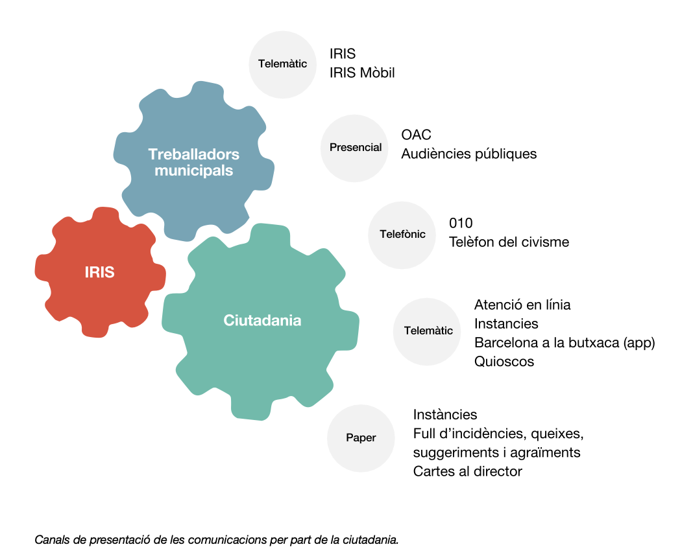
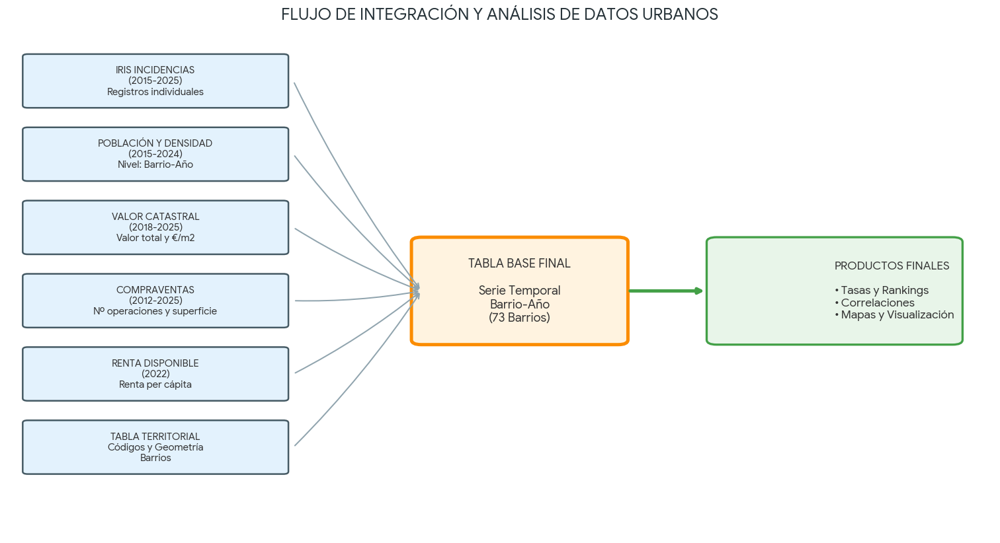
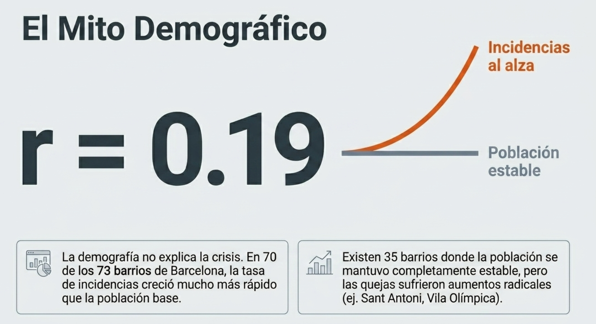
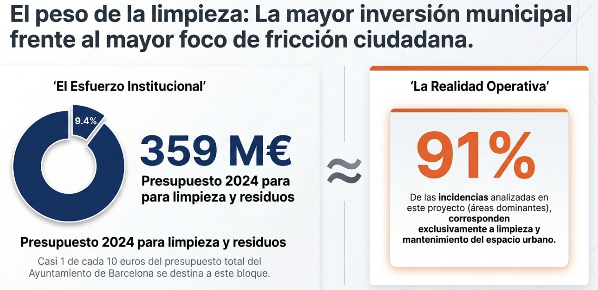

```{python}
#| label: setup
import os
import json
import unicodedata
import re
import warnings

import numpy as np
import pandas as pd
import plotly.express as px
import plotly.graph_objects as go
from plotly.subplots import make_subplots
import matplotlib.pyplot as plt
import seaborn as sns

warnings.filterwarnings("ignore", category=FutureWarning)

ruta_actual = os.getcwd()
if os.path.basename(ruta_actual) == "presentacion":
    ruta_proyecto = os.path.dirname(ruta_actual)
else:
    ruta_proyecto = ruta_actual

RUTA_DATOS_PROCESSED = os.path.join(ruta_proyecto, "datos", "processed")
RUTA_ANALISIS = os.path.join(RUTA_DATOS_PROCESSED, "analisis")
RUTA_IMG = os.path.join(ruta_proyecto, "presentacion", "quarto_assets", "notebook_images")

tabla_base = pd.read_csv(os.path.join(RUTA_DATOS_PROCESSED, "tabla_base_barrio_anio.csv"))
tabla_base["any"] = tabla_base["any"].astype(int)
tabla_base["codi_barri"] = tabla_base["codi_barri"].astype(str)

serie_ciudad = pd.read_csv(os.path.join(RUTA_ANALISIS, "serie_ciudad_poblacion_incidencias_2015_2024.csv"))
df_2024 = pd.read_csv(os.path.join(RUTA_ANALISIS, "analisis_poblacion_densidad_2024.csv"))
crecimiento_barrios = pd.read_csv(os.path.join(RUTA_ANALISIS, "crecimiento_barrios_2015_2024.csv"))
incidencias_totales_2024 = pd.read_csv(os.path.join(RUTA_ANALISIS, "incidencias_totales_barrio_2024.csv"))
incidencias_totales_2025 = pd.read_csv(os.path.join(RUTA_ANALISIS, "incidencias_totales_barrio_2025.csv"))
resumen_areas_2024 = pd.read_csv(os.path.join(RUTA_ANALISIS, "resumen_areas_incidencias_2024.csv"))
resumen_areas_2025 = pd.read_csv(os.path.join(RUTA_ANALISIS, "resumen_areas_incidencias_2025.csv"))
resumen_detalles_2024 = pd.read_csv(os.path.join(RUTA_ANALISIS, "resumen_detalles_incidencias_2024.csv"))
resumen_detalles_2025 = pd.read_csv(os.path.join(RUTA_ANALISIS, "resumen_detalles_incidencias_2025.csv"))
area_dominante_barrio_2024 = pd.read_csv(os.path.join(RUTA_ANALISIS, "area_dominante_barrio_2024.csv"))
equidad_barrio_2022 = pd.read_csv(os.path.join(RUTA_ANALISIS, "equidad_barrio_2022.csv"))
serie_regresion = pd.read_csv(os.path.join(RUTA_ANALISIS, "serie_regresion_incidencias_2015_2025.csv"))
proyeccion_incidencias = pd.read_csv(os.path.join(RUTA_ANALISIS, "proyeccion_incidencias_2025_2026.csv"))
tendencia_poblacion_incidencias_2024 = pd.read_csv(os.path.join(RUTA_ANALISIS, "tendencia_poblacion_incidencias_2024.csv"))

for df_tmp in [
    df_2024,
    crecimiento_barrios,
    incidencias_totales_2024,
    incidencias_totales_2025,
    area_dominante_barrio_2024,
    equidad_barrio_2022,
]:
    if "codi_barri" in df_tmp.columns:
        df_tmp["codi_barri"] = df_tmp["codi_barri"].astype(str)

def normalizar_texto(texto):
    texto = str(texto).lower().strip()
    texto = unicodedata.normalize("NFKD", texto)
    texto = "".join(letra for letra in texto if not unicodedata.combining(letra))
    texto = re.sub(r"[^a-z0-9]+", " ", texto)
    return re.sub(r"\s+", " ", texto).strip()

with open(os.path.join(RUTA_ANALISIS, "barrios_wgs84.geojson"), "r", encoding="utf-8") as f:
    geojson_barrios = json.load(f)

barrios_geo_norm = [feature["properties"]["nom_barri_norm"] for feature in geojson_barrios["features"]]

LABELS_MAPA = {
    "nom_barri_norm": "Barrio",
    "nom_barri": "Barrio",
    "barri": "Barrio",
    "nom_districte": "Distrito",
    "districte": "Distrito",
    "total_incidencias_2024": "Incidencias 2024",
    "total_incidencias_2025": "Incidencias 2025 provisional",
    "poblacion_total": "Población total",
    "densidad_analitica_hab_ha": "Densidad analítica hab./ha",
    "incidencias_por_1000_hab": "Incidencias por 1.000 hab.",
    "area": "Área dominante",
    "casos": "Casos",
}

AREA_COLOR_MAP = {
    "Recollida i neteja de l'espai urbà": "#C97A3D",
    "Manteniment de l'espai urbà": "#2F5D8C",
    "Informació tràmits i atenció ciutadana": "#6B7280",
    "Sanitat i salut pública": "#8C3A4B",
    "Mobilitat": "#0F766E",
    "Hisenda": "#8B5CF6",
    "Urbanisme": "#64748B",
}
COLOR_AREA_FALLBACK = "#D1D5DB"
PALETA_DISTRITOS = px.colors.qualitative.Bold
COLOR_POBLACION = "#1f77b4"
COLOR_INCIDENCIAS = "#ef553b"

def preparar_mapa_por_nombre(df_mapa, columna_barrio):
    df_plot = df_mapa.copy()
    df_plot["nom_barri_norm"] = df_plot[columna_barrio].apply(normalizar_texto)
    df_plot = df_plot[df_plot["nom_barri_norm"].isin(barrios_geo_norm)].copy()
    return df_plot

def limpiar_hover_data(hover_data):
    if hover_data is None:
        return {"nom_barri_norm": False}
    hover_limpio = hover_data.copy() if isinstance(hover_data, dict) else {col: True for col in hover_data}
    hover_limpio["nom_barri_norm"] = False
    return hover_limpio

def mapa_barrios_mapbox(
    df_mapa,
    columna_barrio,
    columna_color,
    escala=("#fff7bc", "#fdae61", "#d73027"),
    hover_data=None,
    color_discrete_map=None,
    labels=None,
    opacity=0.78,
    zoom=11,
):
    df_plot = preparar_mapa_por_nombre(df_mapa, columna_barrio)
    hover_data = limpiar_hover_data(hover_data)
    fig = px.choropleth_mapbox(
        df_plot,
        geojson=geojson_barrios,
        featureidkey="properties.nom_barri_norm",
        locations="nom_barri_norm",
        color=columna_color,
        color_continuous_scale=escala if color_discrete_map is None else None,
        color_discrete_map=color_discrete_map,
        mapbox_style="carto-positron",
        center={"lat": 41.385, "lon": 2.17},
        zoom=zoom,
        opacity=opacity,
        hover_name=columna_barrio,
        hover_data=hover_data,
        labels={**LABELS_MAPA, **(labels or {})},
    )
    fig.update_layout(width=1450, height=720, margin=dict(l=20, r=20, t=20, b=20))
    return fig

def improve_layout(fig, width=1450, height=720, l=95, r=35, t=45, b=80):
    fig.update_layout(
        template="plotly_white",
        width=width,
        height=height,
        margin=dict(l=l, r=r, t=t, b=b),
        font=dict(size=17),
        legend=dict(font=dict(size=14)),
    )
    fig.update_xaxes(tickfont=dict(size=15), title_font=dict(size=17), automargin=True)
    fig.update_yaxes(tickfont=dict(size=15), title_font=dict(size=17), automargin=True)
    return fig
```

## ¿Por qué empecé esta investigación? {.title-slide}

::: {style="display: grid; grid-template-columns: 1.8fr 0.7fr; column-gap: 4rem; align-items: center; width: 100%;"}

::: {style="font-size: 1.65em; line-height: 1.35; max-width: 900px;"}

Una experiencia cotidiana:  
usar **Barcelona a la Butxaca** para reportar limpieza, carteles, grafitis y verde urbano.

**Pregunta:**  
¿Qué historia cuentan esos avisos cuando se miran por barrio, año y tipo de incidencia?

:::

::: {style="justify-self: end; transform: translateX(-60px); text-align: center;"}

{width=470px}

:::

:::

::: {.notes}
El proyecto no nace del uso real de la App Barcelona a la Butxaca. 

Me pregunté: si muchas personas usamos estos canales para avisar al Ayuntamiento,

¿qué patrones emergen cuando esos avisos se agregan por barrio, año y tipología?

OJO: IRIS no mide directamente todo el deterioro urbano.

Mide lo que la ciudadanía decide o puede reportar y lo que el sistema registra.
:::


## De la App...

::: {style="display: flex; justify-content: center; align-items: center; height: 75vh;"}

{width=95%}

:::

::: {.notes}
Barcelona a la Butxaca es un canal móvil para enviar avisos e incidencias.

Esas entradas alimentan a IRIS, que es el **sistema municipal que centraliza incidencias, quejas, sugerencias y peticiones**.

Estamos trabajando con una infraestructura real de relación ciudadanía-Ayuntamiento.

Por eso los datos tienen valor urbano, pero también sesgos de canal, uso y reporte.
:::


## {.full-image}
<div style="display: flex; justify-content: center; align-items: flex-start; height: 82vh; width: 100%; padding-top: 1vh;">



</div>


::: {.notes}
La fuente principal es la serie histórica de registros IRIS,

complementada con información de población, cartografía oficial de barrios,

renta e indicadores inmobiliarios como compraventas, superficie transmitida y valor catastral.
El trabajo técnico se dividió en dos notebooks. El primero se dedicó a depuración y transformación de datos; el segundo concentró análisis visual, interpretación y preparación narrativa.

Para mantener la coherencia territorial se utilizó el código de barrio (codi_barri) como clave principal, evitando depender solo de nombres que pueden variar entre fuentes.

Las tareas principales fueron: limpiar y normalizar campos territoriales; agregar incidencias por barrio y año; integrar población, renta, cartografía y variables inmobiliarias; calcular incidencias por 1.000 habitantes; construir visualizaciones temporales y territoriales; y aplicar una regresión lineal exploratoria para observar tendencia y validar parcialmente el año 2024.

Las tasas por habitante se usaron para evitar comparaciones engañosas entre barrios de distinto tamaño.

También se trató con cautela el período 2020–2022: la pandemia alteró movilidad, uso del espacio público y probablemente hábitos de reporte.

La regresión lineal se incluyó solo como aproximación exploratoria, no como modelo predictivo cerrado.
:::

## A. Contexto demográfico y presión urbana 
::: {.section-card style="font-size: 2em; line-height: 1.4; margin-left: 2rem; margin-right: 2rem;"}
¿Más población o más presión registrada?

La población ayuda a contextualizar, pero no basta para explicar el salto de incidencias.
:::
::: {.notes}
primero mirar la evolución general antes de bajar al mapa. 

La pregunta es si las incidencias crecen solo porque Barcelona tiene más población o 

si hay otros factores de presión urbana, uso del espacio público y facilidad de reporte.

:::

## Barcelona crece, pero las incidencias crecen mucho más {.chart-slide}

```{python}
#| label: fig-serie-ciudad
fig = make_subplots(specs=[[{"secondary_y": True}]])
fig.add_trace(
    go.Scatter(
        x=serie_ciudad["any"], y=serie_ciudad["poblacion_barcelona"],
        mode="lines+markers", name="Población Barcelona",
        line=dict(color=COLOR_POBLACION, width=3), marker=dict(size=8),
        hovertemplate="Año %{x}<br>Población %{y:,.0f}<extra></extra>",
    ),
    secondary_y=False,
)
fig.add_trace(
    go.Scatter(
        x=serie_ciudad["any"], y=serie_ciudad["incidencias_barcelona"],
        mode="lines+markers", name="Incidencias IRIS",
        line=dict(color=COLOR_INCIDENCIAS, width=3), marker=dict(size=8),
        hovertemplate="Año %{x}<br>Incidencias %{y:,.0f}<extra></extra>",
    ),
    secondary_y=True,
)
fig.update_xaxes(title_text="Año", dtick=1)
fig.update_yaxes(title_text="Población total", secondary_y=False)
fig.update_yaxes(title_text="Incidencias IRIS", secondary_y=True)
fig.update_layout(hovermode="x unified", legend=dict(orientation="h", y=1.07, x=0))
improve_layout(fig, height=720, l=90, r=95, t=50, b=70)
fig
```

::: {.notes}
La lectura del informe es que la población crece de forma moderada, 
mientras las incidencias IRIS crecen con mucha más intensidad. 

En 2015 hay 54.990 incidencias y en 2024 hay 127.122.

Parte puede venir de más uso del sistema, cambios de canal y más facilidad de reporte. 
La conclusión prudente es que la presión registrada por IRIS no se explica solo por más habitantes.
:::

## Población 2024 vs incidencias 2024 por barrio {.chart-slide}

```{python}
#| label: fig-poblacion-incidencias
labels_grafico = {
    **LABELS_MAPA,
    "poblacion_total": "Población total 2024",
    "total_incidencias_iris": "Incidencias IRIS 2024",
    "nom_districte": "Distrito",
    "nom_barri": "Barrio",
    "incidencias_por_1000_hab": "Incidencias por 1.000 hab.",
    "densidad_analitica_hab_ha": "Habitantes por hectárea",
}
fig = px.scatter(
    df_2024,
    x="poblacion_total",
    y="total_incidencias_iris",
    color="nom_districte",
    size="densidad_analitica_hab_ha",
    size_max=55,
    labels=labels_grafico,
    hover_name="nom_barri",
    hover_data={
        "poblacion_total": ":,.0f",
        "total_incidencias_iris": ":,.0f",
        "incidencias_por_1000_hab": ":.2f",
        "densidad_analitica_hab_ha": ":.1f",
    },
    color_discrete_sequence=PALETA_DISTRITOS,
)
fig.add_trace(
    go.Scatter(
        x=tendencia_poblacion_incidencias_2024["poblacion_total"],
        y=tendencia_poblacion_incidencias_2024["incidencias_estimadas_linea"],
        mode="lines",
        name="Línea de tendencia",
        line=dict(color="black", width=2.5, dash="dash"),
    )
)
improve_layout(fig, height=720, l=105, r=40, t=45, b=90)
fig
```

::: {.notes}
Este gráfico busca comprobar si los barrios con más población concentran también más incidencias en 2024.

Cada punto es un barrio. El eje X es población total, el eje Y son incidencias IRIS, el color es el distrito y el tamaño indica densidad.

La línea de tendencia muestra una relación clara: barrios más poblados tienden a tener más incidencias en términos absolutos.

Pero no todos los barrios siguen igual la línea. Hay barrios por encima o por debajo de lo esperado para su población.

**Por eso este gráfico sirve para separar dos ideas:**

volumen absoluto: barrios grandes registran más incidencias

intensidad relativa: algunos barrios registran más presión de la que la población por sí sola explicaría.


:::

## Densidad 2024 no equivale a presión relativa {.chart-slide}

```{python}
#| label: fig-densidad-tasa
fig = px.scatter(
    df_2024,
    x="densidad_analitica_hab_ha",
    y="incidencias_por_1000_hab",
    color="nom_districte",
    size="poblacion_total",
    size_max=58,
    labels={
        "densidad_analitica_hab_ha": "Densidad (hab./ha)",
        "incidencias_por_1000_hab": "Incidencias por 1.000 habitantes",
        "nom_districte": "Distrito",
        "poblacion_total": "Población total",
        "nom_barri": "Barrio",
    },
    hover_name="nom_barri",
    hover_data={"poblacion_total": ":,.0f", "total_incidencias_iris": ":,.0f"},
    color_discrete_sequence=PALETA_DISTRITOS,
)
improve_layout(fig, height=720, l=120, r=40, t=45, b=90)
fig
```

::: {.notes}
Este gráfico mantiene el mismo año que la diapositiva anterior: 2024.

Aquí ya no miro incidencias totales, sino incidencias por 1.000 habitantes.

El objetivo es comprobar si los barrios más densos son también los que registran más presión relativa.

La respuesta es que no necesariamente: hay barrios densos que no lideran la tasa por habitante y barrios menos densos con tasas altas.

La densidad se calcula para 2024 usando población 2024 y superficie oficial del barrio. 

Por eso la comparación temporal no cambia: población, incidencias y tasa están leídas en 2024.

Lo que cambia respecto al gráfico anterior es la métrica: 

paso de volumen absoluto a tasa por habitante para no confundir tamaño con presión.


:::

## Incidencias por 1.000 habitantes: +118% {.chart-slide}

```{python}
#| label: fig-tasa-tiempo
fig = px.line(
    serie_ciudad,
    x="any",
    y="incidencias_por_1000_hab",
    markers=True,
    labels={"any": "Año", "incidencias_por_1000_hab": "Incidencias por 1.000 habitantes"},
)
fig.update_traces(line=dict(color=COLOR_INCIDENCIAS, width=4), marker=dict(size=10))
fig.update_xaxes(dtick=1)
improve_layout(fig, height=660, l=115, r=35, t=45, b=80)
fig
```

::: {.notes}
Esta diapositiva no busca repetir el gráfico de población e incidencias.

Aquí cambio de pregunta: 
ya no miro qué barrios concentran más volumen en 2024, sino si el aumento de incidencias se mantiene al ajustar por población.

La tasa ciudadana de incidencias pasa de 34 a 75 por 1.000 habitantes entre 2015 y 2024, un aumento de alrededor del 118%. 

incluso ajustando por población, el sistema registra mucha más presión.

Esto no equivale a decir que la ciudad esté el doble de mal.

Equivale a decir que IRIS registra mucha más demanda ciudadana relativa.
:::


## B. Distribución territorial
::: {.section-card style="font-size: 2em; line-height: 1.4;"}

Dónde se concentra el volumen, dónde aparece presión relativa y qué cambia al mirar tipologías.

:::

::: {.notes}
La idea es que los mapas no son decorativos: 

permiten ver que el volumen absoluto y la tasa relativa cuentan historias diferentes.

:::

## Incidencias totales por barrio en 2024 {.chart-slide}

```{python}
#| label: mapa-2024
mapa_2024 = incidencias_totales_2024.merge(
    df_2024[["codi_barri", "nom_barri", "nom_districte", "poblacion_total", "incidencias_por_1000_hab"]],
    on="codi_barri",
    how="left",
)
fig = mapa_barrios_mapbox(
    mapa_2024,
    columna_barrio="nom_barri",
    columna_color="total_incidencias_2024",
    escala=("#eff6ff", "#93c5fd", "#1d4ed8"),
    hover_data={
        "nom_barri_norm": False,
        "nom_districte": True,
        "total_incidencias_2024": ":,.0f",
        "poblacion_total": ":,.0f",
        "incidencias_por_1000_hab": ":.2f",
    },
)
fig
```

::: {.notes}
Los valores absolutos sirven para dimensionar carga operativa municipal. 

En el informe destacan barrios como el Raval, la Dreta de l'Eixample, Sant Pere, Santa Caterina i la Ribera y Sant Antoni.

Volumen alto de INC puede reflejar población, centralidad, tránsito, turismo, actividad económica o mezcla de usos. 

No es un ranking simple de barrios “peores”.
:::

## Incidencias por 1.000 habitantes por barrio {.chart-slide}

```{python}
#| label: mapa-tasa-2024
fig = mapa_barrios_mapbox(
    mapa_2024,
    columna_barrio="nom_barri",
    columna_color="incidencias_por_1000_hab",
    escala=("#fff7ed", "#fdba74", "#c2410c"),
    hover_data={
        "nom_barri_norm": False,
        "nom_districte": True,
        "total_incidencias_2024": ":,.0f",
        "poblacion_total": ":,.0f",
        "incidencias_por_1000_hab": ":.2f",
    },
)
fig
```

::: {.notes}
Aquí cambia la lectura. El ranking relativo no reemplaza al absoluto; lo complementa. 

Barrios pequeños pueden aparecer muy altos porque pocos casos representan mucha intensidad por residente.

**absolutos para carga de gestión, tasas para intensidad relativa**
:::

## C. Tipologías de incidencias
::: {.section-card style="font-size: 2em; line-height: 1.4;"}

Pasamos de “cuántas” incidencias hay a “de qué tipo” son.

:::

::: {.notes}
el interés inicial venía de limpieza, carteles, grafitis y verde urbano, pero el dataset permite ver qué áreas dominan realmente el sistema.
:::

## Áreas y detalles principales de incidencias 2024 {.chart-slide}

```{python}
#| label: fig-areas-detalles-2024
areas = resumen_areas_2024.head(10).sort_values("casos").copy()
detalles = resumen_detalles_2024.head(10).sort_values("casos").copy()
if "porcentaje_total" not in areas.columns and "peso_pct" in areas.columns:
    areas["porcentaje_total"] = areas["peso_pct"]

fig = make_subplots(
    rows=1,
    cols=2,
    subplot_titles=("Áreas principales 2024", "Detalles principales 2024"),
    horizontal_spacing=0.30,
)
fig.add_trace(
    go.Bar(
        x=areas["casos"],
        y=areas["area"],
        orientation="h",
        marker=dict(color=[AREA_COLOR_MAP.get(area, COLOR_AREA_FALLBACK) for area in areas["area"]]),
        customdata=areas[["porcentaje_total"]],
        hovertemplate="<b>%{y}</b><br>Incidencias: %{x:,.0f}<br>Peso: %{customdata[0]:.1f}%<extra></extra>",
    ),
    row=1,
    col=1,
)
fig.add_trace(
    go.Bar(
        x=detalles["casos"],
        y=detalles["detall"],
        orientation="h",
        marker=dict(color=[AREA_COLOR_MAP.get(area, COLOR_AREA_FALLBACK) for area in detalles["area"]]),
        customdata=detalles[["area", "porcentaje_total"]],
        hovertemplate="<b>%{y}</b><br>Área: %{customdata[0]}<br>Incidencias: %{x:,.0f}<br>Peso: %{customdata[1]:.1f}%<extra></extra>",
    ),
    row=1,
    col=2,
)
fig.update_layout(showlegend=False)
improve_layout(fig, width=1460, height=720, l=260, r=30, t=70, b=80)
fig
```

::: {.notes}
En 2024, las incidencias se concentran de forma muy clara en dos áreas: recogida/limpieza y

 mantenimiento del espacio urbano. Juntas explican el 90,8% del total de incidencias con barrio.

los detalles heredan el color del área a la que pertenecen. 

**Esta continuidad visual ayuda a leer tipología y territorio como una misma historia.**
:::
## Dos ciudades dentro de una {.chart-slide}

```{python}
#| label: mapa-area-dominante
area_dominante_plot = area_dominante_barrio_2024.merge(
    incidencias_totales_2024[["codi_barri", "total_incidencias_2024"]],
    on="codi_barri",
    how="left",
)
fig = mapa_barrios_mapbox(
    area_dominante_plot,
    columna_barrio="barri",
    columna_color="area",
    hover_data={
        "nom_barri_norm": False,
        "districte": True,
        "area": True,
        "casos": ":,.0f",
        "total_incidencias_2024": ":,.0f",
    },
    color_discrete_map=AREA_COLOR_MAP,
)
fig
```

::: {.notes}
Este mapa sostiene la idea de “dos ciudades dentro de una”. 

Los colores son consistentes con la diapo  anterior

En varios barrios centrales domina más limpieza y recogida

en un número mayor de barrios domina mantenimiento del espacio urbano.


:::
## {.full-image}
<div style="display: flex; justify-content: center; align-items: flex-start; height: 82vh; width: 100%; padding-top: 1vh;">


</div>

::: {.notes}
49 barrios están dominados por mantenimiento y 24 por recogida/limpieza, 

aunque limpieza acumula mucho volumen en barrios muy intensos. 

Dominante no significa única.

::: 

## D. Cuando la población no explica la trayectoria
::: {.section-card style="font-size: 2em; line-height: 1.4;"}

Algunos barrios registran más incidencias aunque su población no crezca al mismo ritmo.
:::

::: {.notes}
Este bloque cierra la pregunta demográfica.

Ya vimos que población e incidencias se relacionan en volumen, pero ahora miro la evolución barrio a barrio.

La pregunta es: qué pasa cuando la población se mantiene estable o incluso baja, pero las incidencias siguen creciendo.

Eso permite pasar de una relación general a una lectura de trayectorias y cuadrantes.
:::

## Casos de contraste: población e incidencias (2015-2024) {.chart-slide}

```{python}
#| label: fig-trayectorias-con-poblacion

poblacion_barrios = pd.read_csv(os.path.join(RUTA_ANALISIS, "poblacion_barrios_2015_2024.csv"))
poblacion_barrios["codi_barri"] = poblacion_barrios["codi_barri"].astype(str)

barrios_representativos = list(dict.fromkeys(pd.concat([
    crecimiento_barrios.sort_values("crecimiento_poblacion_abs", ascending=False)["nom_barri"].head(5),
    crecimiento_barrios.sort_values("crecimiento_poblacion_abs", ascending=True)["nom_barri"].head(5),
    crecimiento_barrios.sort_values("crecimiento_incidencias_pct", ascending=False)["nom_barri"].head(5),
]).dropna().tolist()))
tray = tabla_base[
    (tabla_base["nom_barri"].isin(barrios_representativos))
    & (tabla_base["any"].between(2015, 2024))
].copy()

tray["codi_barri"] = tray["codi_barri"].astype(str)

tray = tray.merge(
    poblacion_barrios[["any", "codi_barri", "poblacion_total"]],
    on=["any", "codi_barri"],
    how="left"
)

fig = make_subplots(specs=[[{"secondary_y": True}]])

palette = px.colors.qualitative.Bold + px.colors.qualitative.Set2
color_map = {
    barrio: palette[i % len(palette)]
    for i, barrio in enumerate(barrios_representativos)
}

for barrio in barrios_representativos:
    df_b = tray[tray["nom_barri"] == barrio].sort_values("any")
    color = color_map[barrio]

    fig.add_trace(
        go.Scatter(
            x=df_b["any"],
            y=df_b["total_incidencias_iris"],
            mode="lines+markers",
            name=barrio,
            legendgroup=barrio,
            line=dict(color=color, width=3),
            marker=dict(size=7),
            hovertemplate=(
                f"<b>{barrio}</b><br>"
                "Año %{x}<br>"
                "Incidencias %{y:,.0f}<extra></extra>"
            ),
        ),
        secondary_y=False,
    )

    fig.add_trace(
        go.Scatter(
            x=df_b["any"],
            y=df_b["poblacion_total"],
            mode="lines",
            name=f"{barrio} · población",
            legendgroup=barrio,
            showlegend=False,
            line=dict(color=color, width=2, dash="dot"),
            hovertemplate=(
                f"<b>{barrio}</b><br>"
                "Año %{x}<br>"
                "Población %{y:,.0f}<extra></extra>"
            ),
        ),
        secondary_y=True,
    )

fig.update_xaxes(title_text="Año", dtick=1)
fig.update_yaxes(title_text="Incidencias IRIS", secondary_y=False)
fig.update_yaxes(title_text="Población", secondary_y=True)

fig.update_layout(
    title="Casos de contraste: incidencias y población",
    hovermode="x unified",
    legend=dict(
        orientation="v",
        yanchor="top",
        y=1,
        xanchor="left",
        x=1.03,
        font=dict(size=12),
    ),
)

improve_layout(fig, height=700, l=105, r=190, t=60, b=80)
fig

```

::: {.notes}
Este gráfico no pretende mostrar todos los barrios.

Muestra casos de contraste para pasar de promedios de ciudad a trayectorias reales.

El criterio de selección es: barrios con mayor crecimiento de población, barrios con mayor pérdida de población y 

barrios con mayor aumento relativo de incidencias.

La idea es comparar comportamientos extremos para ver si población e incidencias evolucionan siempre juntas.

Este gráfico muestra que el aumento de incidencias no siempre va ligado al crecimiento de población residente. 

**En barrios como el Raval, Sant Antoni o el Poble-sec, la población cae o se estanca, pero las incidencias remontan.** 

Eso sugiere que IRIS también está captando presión urbana no residencial: visitantes, actividad económica, turismo, 

rotación y uso intensivo del espacio público.
:::

## Cuadrantes de crecimiento poblacional e incidencias (2015 -2024) {.chart-slide}

```{python}
#| label: fig-cuadrantes
crecimiento_reactivo = crecimiento_barrios.replace([np.inf, -np.inf], np.nan).copy()
condiciones = [
    (crecimiento_reactivo["crecimiento_poblacion_pct"] >= 0) & (crecimiento_reactivo["crecimiento_incidencias_pct"] >= 0),
    (crecimiento_reactivo["crecimiento_poblacion_pct"] < 0) & (crecimiento_reactivo["crecimiento_incidencias_pct"] >= 0),
    (crecimiento_reactivo["crecimiento_poblacion_pct"] < 0) & (crecimiento_reactivo["crecimiento_incidencias_pct"] < 0),
    (crecimiento_reactivo["crecimiento_poblacion_pct"] >= 0) & (crecimiento_reactivo["crecimiento_incidencias_pct"] < 0),
]
etiquetas = ["Población e incidencias suben", "Población baja e incidencias suben", "Ambas bajan", "Población sube e incidencias bajan"]
crecimiento_reactivo["cuadrante"] = np.select(condiciones, etiquetas, default="Sin clasificar")
fig = px.scatter(
    crecimiento_reactivo,
    x="crecimiento_poblacion_pct",
    y="crecimiento_incidencias_pct",
    color="cuadrante",
    hover_name="nom_barri",
    labels={
        "crecimiento_poblacion_pct": "Crecimiento población 2015-2024 (%)",
        "crecimiento_incidencias_pct": "Crecimiento incidencias 2015-2024 (%)",
        "cuadrante": "Cuadrante",
    },
)
fig.add_hline(y=0, line_color="black", line_dash="dash")
fig.add_vline(x=0, line_color="black", line_dash="dash")
improve_layout(fig, height=710, l=110, r=35, t=45, b=90)
fig
```

::: {.notes}


Especialmente interesan los barrios donde la población baja o se mantiene estable pero las incidencias suben. 

Esa combinación apunta a presión urbana que no se explica solo por más residentes.

Este gráfico busca mostrar:

Si el aumento de incidencias se puede explicar solo por crecimiento de población o si hay barrios donde las

incidencias suben aunque la población no crezca.


:::

## Top 10 barrios con población estable e incidencias al alza {.chart-slide}

```{python}
#| label: fig-deterioro
barrios_deterioro = crecimiento_reactivo[
    (crecimiento_reactivo["crecimiento_poblacion_pct"].abs() < 5)
    & (crecimiento_reactivo["crecimiento_incidencias_pct"] > 15)
].copy()
barrios_deterioro = barrios_deterioro.sort_values("crecimiento_incidencias_pct", ascending=True).tail(10)
fig = px.bar(
    barrios_deterioro,
    x="crecimiento_incidencias_pct",
    y="nom_barri",
    orientation="h",
    labels={"crecimiento_incidencias_pct": "Crecimiento incidencias (%)", "nom_barri": "Barrio"},
)
fig.update_traces(marker_color="#d62828")
improve_layout(fig, height=700, l=240, r=35, t=45, b=80)
fig
```

::: {.notes}
Barrios con población bastante estable pero incidencias claramente al alza. 

La lectura no debe ser punitiva, sino operativa: 

dónde hay señales de presión acumulada que conviene mirar con más detalle.

**El criterio de selección es:**

población entre -5% y +5% entre 2015 y 2024, e incidencias con crecimiento superior al 15%.
:::
## {.full-image}
<div style="display: flex; justify-content: center; align-items: flex-start; height: 82vh; width: 100%; padding-top: 1vh;">



</div>

::: {.notes}
El valor r = 0,19 indica **una relación débil** entre crecimiento poblacional y crecimiento de incidencias.

es decir.... sino que no alcanza para explicar por sí sola el crecimiento de incidencias.

Por eso hablo de “mito demográfico”: no porque la demografía sea irrelevante, sino porque no basta como explicación única.

IRIS registra presión urbana que también puede venir de uso intensivo del espacio público, actividad económica, visitantes, turismo, rotación y hábitos de comunicación ciudadana.

:::

## E. Mercado inmobiliario 
::: {.section-card style="font-size: 2em; line-height: 1.4;"}

Incorporo tres variables de escala urbana para comprobar si el volumen de incidencias IRIS se relaciona con la actividad inmobiliaria.
:::

::: {.notes}
Este bloque incorpora tres variables disponibles en Open Data: compraventas anuales, superficie transmitida y valor catastral unitario.

El objetivo es comparar qué dimensión del mercado inmobiliario se parece más al patrón de incidencias en valores absolutos.

La lectura no es causal: no digo que las compraventas causen incidencias.

La hipótesis es que algunas variables inmobiliarias capturan escala urbana, movimiento y actividad del barrio.
:::

## Comparación de correlaciones absolutas periodo 2018-2024 {.chart-slide}

```{python}
#| label: fig-inmo
df_inmo = tabla_base[tabla_base["any"].between(2018, 2024)].copy()
for col in ["total_incidencias_iris", "total_compraventas_anual"]:
    df_inmo[col] = pd.to_numeric(df_inmo[col], errors="coerce")
df_inmo_plot = df_inmo.dropna(subset=["total_incidencias_iris", "total_compraventas_anual"]).copy()


```

```{python}
#| label: fig-correlaciones
for col in [
    "total_incidencias_iris",
    "total_compraventas_anual",
    "total_superficie_compraventas_m2_anual",
    "valor_catastral_unitario_eur_m2_mean",
]:
    df_inmo[col] = pd.to_numeric(df_inmo[col], errors="coerce")

correlaciones_inmo = pd.DataFrame([
    {
        "variable": "Compraventas anuales",
        "correlacion": df_inmo[["total_incidencias_iris", "total_compraventas_anual"]].corr().iloc[0, 1],
    },
    {
        "variable": "Superficie transmitida",
        "correlacion": df_inmo[["total_incidencias_iris", "total_superficie_compraventas_m2_anual"]].corr().iloc[0, 1],
    },
    {
        "variable": "Valor catastral unitario",
        "correlacion": df_inmo[["total_incidencias_iris", "valor_catastral_unitario_eur_m2_mean"]].corr().iloc[0, 1],
    },
])
fig = px.bar(
    correlaciones_inmo.sort_values("correlacion"),
    x="correlacion",
    y="variable",
    orientation="h",
    labels={"correlacion": "Correlación con incidencias", "variable": ""},
    color="correlacion",
    color_continuous_scale=["#e5e7eb", "#1d4ed8"],
)
fig.add_vline(x=0, line_color="black", line_width=1)
improve_layout(fig, height=650, l=220, r=45, t=45, b=80)
fig
```

::: {.notes}
Yo esperaba que la superficie transmitida pudiera tener una relación más clara, porque una mayor superficie residencial podría asociarse a más capacidad habitacional. 

Sin embargo, en los datos la variable que más correlaciona con incidencias es el número de compraventas anuales.

¿Por qué puede pasar?

Porque las compraventas anuales no solo miden vivienda; también capturan movimiento urbano: rotación residencial, 

actividad económica, cambios de uso, reformas, mudanzas, presión sobre el espacio público y dinamismo del barrio. 

En cambio, la superficie transmitida puede estar más condicionada por operaciones grandes puntuales y no necesariamente por más interacción cotidiana con la ciudad.

**La superficie mide tamaño físico transmitido; las compraventas miden frecuencia de movimiento.**

Y para IRIS parece pesar más la frecuencia de actividad urbana que el tamaño de las operaciones.

La correlación se calcula sobre observaciones barrio-año del periodo 2018-2024.

Es decir, no compara solo barrios en un año, sino todos los registros disponibles del periodo.
:::

## F. Equidad territorial
::: {.section-card style="font-size: 2em; line-height: 1.4;"}
Incorporo la variable **renta** para comprobar si la presión registrada por IRIS se distribuye de manera equitativa entre los distintos barrios.
:::

::: {.notes}
la renta como variable de contexto socioeconómico.

La renta procede del dataset de renta disponible de los hogares por barrio, correspondiente a 2022.

La cruzo con las incidencias por 1.000 habitantes 

:::

## Renta e incidencias (2022) por 1.000 habitantes en los barrios {.chart-slide}

```{python}
#| label: fig-renta
fig = px.scatter(
    equidad_barrio_2022,
    x="renta_media_barrio_eur",
    y="incidencias_por_1000_hab",
    color="nom_districte" if "nom_districte" in equidad_barrio_2022.columns else None,
    size="poblacion_total" if "poblacion_total" in equidad_barrio_2022.columns else None,
    hover_name="nom_barri",
    trendline="ols",
    labels={
        "renta_media_barrio_eur": "Renta media por habitante (€)",
        "incidencias_por_1000_hab": "Incidencias por 1.000 habitantes",
        "nom_districte": "Distrito",
    },
    color_discrete_sequence=PALETA_DISTRITOS,
)
improve_layout(fig, height=710, l=115, r=35, t=45, b=90)
fig
```

::: {.notes}
Este gráfico cruza dos variables normalizadas por población.

En el eje X aparece la renta media por habitante del barrio, en euros.  
En el eje Y aparecen las incidencias IRIS por cada 1.000 habitantes.

Lo que busco comprobar es si los barrios con mayor o menor renta presentan niveles claramente distintos de presión registrada.

La lectura principal es que no aparece una relación lineal fuerte: hay barrios con rentas similares y niveles muy distintos de incidencias.

Por eso la renta ayuda a contextualizar, pero no explica por sí sola la variabilidad de incidencias entre barrios.


**Para Barcelona completa** usando todos los barrios juntos, el R² sería aproximadamente:

R² = 0,016

Es decir, la renta explica solo alrededor del 1,6% de la variación de incidencias por 1.000 habitantes entre barrios.

La correlación global es negativa pero muy débil:

correlación = -0,128


En el conjunto de Barcelona, la relación lineal entre renta e incidencias por habitante es prácticamente nula. 
Por eso no puedo decir que la renta explique el patrón general. 
Lo interesante aparece al mirar diferencias internas por distrito, donde algunos distritos muestran pendientes distintas.”

**No hay una regla única para toda Barcelona**
:::

## Distribución por cuartiles de renta {.chart-slide}

```{python}
#| label: fig-cuartiles
orden = ["Q1 renta más baja", "Q2", "Q3", "Q4 renta más alta"]
fig = px.box(
    equidad_barrio_2022,
    x="cuartil_renta",
    y="incidencias_por_1000_hab",
    category_orders={"cuartil_renta": orden},
    points="all",
    hover_name="nom_barri",
    labels={"cuartil_renta": "Cuartil de renta", "incidencias_por_1000_hab": "Incidencias por 1.000 habitantes"},
)
fig.update_traces(marker_color="#2F5D8C")
improve_layout(fig, height=650, l=115, r=35, t=45, b=90)
fig
```

::: {.notes}
línea central como mediana, caja como 50% central, puntos como barrios concretos. 

La idea principal es que hay variabilidad dentro de todos los cuartiles; 

la renta no explica **por sí sola** la variabilidad de incidencias.
:::

## G. Proyección simple 2025-2026{.chart-slide}

::: {.section-card style="font-size: 2em; line-height: 1.4;"}

Anticipar, no adivinar  

La regresión se usa como prueba exploratoria para pensar en gestión preventiva.

:::

::: {.notes}
esta regresión no pretende sustituir modelos avanzados. 

Su objetivo es abrir una línea exploratoria. 

IRIS ya permite analizar el pasado y podría servir como base para proyectar tendencias si se incorporan más variables y granularidad.
:::

## Modelo exploratorio de tendencia {.chart-slide}

```{python}
#| label: fig-proyeccion
serie_real_confirmada = serie_regresion[serie_regresion["any"].between(2015, 2024)].copy()
anios_excluidos = [2020, 2021, 2022]
serie_excluida = serie_real_confirmada[serie_real_confirmada["any"].isin(anios_excluidos)]
serie_entrenamiento = serie_real_confirmada[~serie_real_confirmada["any"].isin(anios_excluidos)]
coef = np.polyfit(serie_entrenamiento["any"], serie_entrenamiento["total_incidencias_iris"], 1)
linea_x = np.arange(2015, 2027)
linea_y = coef[0] * linea_x + coef[1]
fig = go.Figure()
fig.add_trace(go.Scatter(x=serie_real_confirmada["any"], y=serie_real_confirmada["total_incidencias_iris"], mode="lines+markers", name="Serie real 2015-2024", line=dict(color="#1f77b4", width=3)))
fig.add_trace(go.Scatter(x=serie_excluida["any"], y=serie_excluida["total_incidencias_iris"], mode="markers", name="Años excluidos", marker=dict(color="#9ca3af", size=12, symbol="x")))
fig.add_trace(go.Scatter(x=linea_x, y=linea_y, mode="lines", name="Tendencia lineal exploratoria", line=dict(color="#d62828", width=3, dash="dash")))
fig.add_trace(go.Scatter(x=proyeccion_incidencias["any"], y=proyeccion_incidencias["incidencias_estimadas"], mode="markers", name="Proyección", marker=dict(color="#f77f00", size=12)))
fig.update_xaxes(title_text="Año", dtick=1)
fig.update_yaxes(title_text="Incidencias IRIS")
fig.update_layout(hovermode="x unified")
improve_layout(fig, height=710, l=105, r=35, t=45, b=90)
fig
```

::: {.notes}
el modelo presenta ajuste alto (R² de 0,9772) en el entrenamiento final y 

validación razonable sobre 2024 con un error porcentual de -2,96%

Después de incorporar 2024 al entrenamiento: 
                    
                    **la proyección estimó 137.309 incidencias para 2025 y 145.672 para 2026**

pero sigue siendo una regresión lineal simple

Con histórico de IRIS, barrio, mes, área y variables urbanas, 

se puede pasar de una lógica solo reactiva a una gestión más preventiva.
:::

## Cierre {.full-image}



::: {.notes}
IRIS no es una fotografía completa de Barcelona, pero sí una ventana útil para leer cómo la ciudad detecta, comunica y gestiona problemas cotidianos.

granularidad mensual, canal de entrada, tiempos de resolución y modelos por tipología.

Como aportación práctica, el proyecto plantea que estos datos podrían utilizarse no solo para responder avisos,

sino para anticiparlos. Con más variables, mayor granularidad y modelos más robustos, el Ayuntamiento podría

detectar zonas y tipologías con mayor probabilidad de incidencia y planificar recursos antes de que el problema se acumule.

IRIS mide incidencias reportadas, no todos los problemas existentes. 

Esa diferencia es central para evitar conclusiones injustas o demasiado simples sobre los barrios.
:::

## Alcance y cautelas metodológicas {.chart-slide}

::: {.section-card style="font-size: 1.65em; line-height: 1.4;"}
<p style="margin-bottom: 1.5rem;"><strong>IRIS mide incidencias reportadas,<br>no el estado objetivo completo del espacio urbano</strong></p>

<div style="display: grid; grid-template-columns: 1fr 1fr; gap: 2rem; font-size: 0.8em; text-align: left; max-width: 1100px; margin: 0 auto;">
<div>
<p><strong>Cautelas de interpretación:</strong></p>
<ul>
<li><strong>Canal de reporte:</strong> no analizo diferencias entre app, web, teléfono u otros canales</li>
<li><strong>Serie temporal:</strong> 2020-2022 pueden reflejar pandemia y cambios de uso del servicio</li>
<li><strong>Población de referencia:</strong> el padrón no recoge visitantes ni población flotante</li>
<li><strong>Visibilidad:</strong> algunos problemas son más fáciles de detectar o comunicar que otros</li>
</ul>
</div>
<div>
<p><strong>Un aumento de incidencias puede significar:</strong></p>
<ul>
<li>Más problemas reales</li>
<li>Más facilidad de reporte</li>
<li>Mayor uso del canal</li>
<li>Más presión urbana visible</li>
</ul>
</div>
</div>
:::

::: {.notes}
Esta diapositiva no busca debilitar el análisis, sino delimitar su alcance.

IRIS no mide todos los problemas existentes, sino los problemas que la ciudadanía reporta y que el sistema registra.

Por eso el crecimiento de incidencias no debe interpretarse automáticamente como deterioro objetivo.

No analizo el canal de entrada de cada incidencia, así que no puedo medir directamente brechas digitales o diferencias entre app, web y teléfono.

Sí puedo señalarlo como cautela: distintos barrios y grupos de edad pueden tener distinta facilidad o hábito de comunicación con el sistema.

La pandemia también es una cautela temporal, porque puede alterar tanto el uso del espacio público como la forma de reportar incidencias.

La conclusión prudente es que IRIS permite analizar presión urbana registrada, no el estado completo y objetivo del espacio urbano.
:::

## Valor y límites del análisis {.chart-slide}

<div style="display: grid; grid-template-columns: 1fr 1fr; gap: 3rem; font-size: 1.4em; margin-top: 2rem;">
<div style="background: #ECFDF5; padding: 2rem; border-radius: 12px;">
<h3 style="color: #059669; margin-bottom: 1rem;">Lo que sí muestra</h3>
<ul style="font-size: 0.75em; text-align: left; line-height: 1.6;">
<li>Patrones territoriales claros</li>
<li>Diferencias entre volumen absoluto y tasa relativa</li>
<li>Predominio de limpieza y mantenimiento urbano</li>
<li>Barrios donde las incidencias suben sin crecer la población</li>
<li>Variables de contexto que ayudan a interpretar la presión registrada</li>
</ul>
</div>
<div style="background: #FEF2F2; padding: 2rem; border-radius: 12px;">
<h3 style="color: #DC2626; margin-bottom: 1rem;">Lo que no permite concluir</h3>
<ul style="font-size: 0.75em; text-align: left; line-height: 1.6;">
<li>Si Barcelona está objetivamente peor</li>
<li>Causalidad directa entre población, renta o mercado e incidencias</li>
<li>Eficiencia del servicio municipal</li>
<li>Si hay deterioro real o cambio en hábitos de reporte</li>
</ul>
</div>
</div>

<div style="margin-top: 2.5rem; font-size: 1.25em; background: #F3F4F6; padding: 1.5rem; border-radius: 12px; max-width: 950px; margin-left: auto; margin-right: auto;">
<p><strong>Propuesta de mejora:</strong> usar IRIS como sistema de alerta temprana, combinándolo con inspecciones, tiempos de resolución y datos objetivos para actuar antes en zonas con alta presión por habitante.</p>
</div>

::: {.notes}
Esta diapositiva cierra el análisis con equilibrio: muestra qué aporta el proyecto y qué límites tiene.

La idea no es vender IRIS como una fotografía total de Barcelona, sino como una fuente útil para detectar señales, priorizar preguntas y abrir una línea de gestión preventiva.

La crítica constructiva es que el Ayuntamiento podría usar técnicas como esta no solo para responder incidencias, sino para anticiparlas.

Especialmente en zonas con tasas altas por 1.000 habitantes, una lectura preventiva permitiría reforzar mantenimiento, limpieza o inspección antes de que la carga recaiga siempre en que el vecino tenga que reclamar.

La conclusión defendible es que IRIS permite leer presión urbana registrada, pero necesita complementarse con otras fuentes para explicar causas y diseñar políticas con más evidencia.
:::

## {.chart-slide}

::: {.section-card}

<div style="display: flex; justify-content: center; align-items: center; min-height: 360px; text-align: center; font-size: 4em; font-weight: 700; color: white;">

Muchas gracias

</div>

:::
